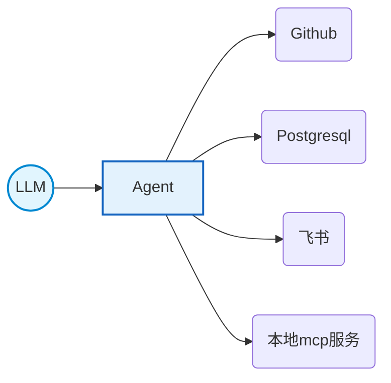

[toc]
### tools-内置能力

#### 解析结果

Claude code提供了一系列tools，每次会话时，cc会将自己能提供的工具列表发送给调用的外部大模型LLM，下面是一次调用过程中关于tools的解析结果。


#### 基础能力

有以下几个基础的能力
- 读写（Read、Write、Edit）
- 执行 Bash
- 查找（WebSearch、WebFetch）
- 管理（Task、Agent、Memory）


### CC权限
#### cc如何管理权限

- **Allow** 规则让 Claude Code 使用指定的工具而无需手动批准。
- **Ask** 规则在 Claude Code 尝试使用指定工具时提示确认。
- **Deny** 规则防止 Claude Code 使用指定的工具。

以上的权限设置在settings.json 文件中
#### 权限模式

|模式|描述|
|---|---|
|`default`|标准行为：在首次使用每个工具时提示权限|
|`acceptEdits`|自动接受工作目录或 `additionalDirectories` 中路径的文件编辑和常见文件系统命令（`mkdir`、`touch`、`mv`、`cp` 等）|
|`plan`|Plan Mode：Claude 读取文件并运行只读 shell 命令来探索，但不编辑您的源文件|
|`auto`|自动批准工具调用，并进行后台安全检查以验证操作与您的请求一致。目前处于研究预览阶段|
|`dontAsk`|自动拒绝工具，除非通过 `/permissions` 或 `permissions.allow` 规则预先批准|
|`bypassPermissions`|跳过所有权限提示。根目录和主目录删除操作（如 `rm -rf /`）仍会作为断路器提示|

### Bash工具
#### Bash工具的具体描述
```json
{
        "name": "Bash",
        "description": "Executes a given bash command and returns its output.\n\nThe working directory persists between commands, but shell state does not. The shell environment is initialized from the user's profile (bash or zsh).\n\nIMPORTANT: Avoid using this tool to run `find`, `grep`, `cat`, `head`, `tail`, `sed`, `awk`, or `echo` commands, unless explicitly instructed or after you have verified that a dedicated tool cannot accomplish your task. Instead, use the appropriate dedicated tool as this will provide a much better experience for the user:\n\n - File search: Use Glob (NOT find or ls)\n - Content search: Use Grep (NOT grep or rg)\n - Read files: Use Read (NOT cat/head/tail)\n - Edit files: Use Edit (NOT sed/awk)\n - Write files: Use Write (NOT echo >/cat <<EOF)\n - Communication: Output text directly (NOT echo/printf)\nWhile the Bash tool can do similar things, it’s better to use the built-in tools as they provide a better user experience and make it easier to review tool calls and give permission.\n\n# Instructions\n - If your command will create new directories or files, first use this tool to run `ls` to verify the parent directory exists and is the correct location.\n - Always quote file paths that contain spaces with double quotes in your command (e.g., cd \"path with spaces/file.txt\")\n - Try to maintain your current working directory throughout the session by using absolute paths and avoiding usage of `cd`. You may use `cd` if the User explicitly requests it. In particular, never prepend `cd <current-directory>` to a `git` command — `git` already operates on the current working tree, and the compound triggers a permission prompt.\n - You may specify an optional timeout in milliseconds (up to 600000ms / 10 minutes). By default, your command will timeout after 120000ms (2 minutes).\n - You can use the `run_in_background` parameter to run the command in the background. Only use this if you don't need the result immediately and are OK being notified when the command completes later. You do not need to check the output right away - you'll be notified when it finishes. You do not need to use '&' at the end of the command when using this parameter.\n - When issuing multiple commands:\n  - If the commands are independent and can run in parallel, make multiple Bash tool calls in a single message. Example: if you need to run \"git status\" and \"git diff\", send a single message with two Bash tool calls in parallel.\n  - If the commands depend on each other and must run sequentially, use a single Bash call with '&&' to chain them together.\n  - Use ';' only when you need to run commands sequentially but don't care if earlier commands fail.\n  - DO NOT use newlines to separate commands (newlines are ok in quoted strings).\n - For git commands:\n  - Prefer to create a new commit rather than amending an existing commit.\n  - Before running destructive operations (e.g., git reset --hard, git push --force, git checkout --), consider whether there is a safer alternative that achieves the same goal. Only use destructive operations when they are truly the best approach.\n  - Never skip hooks (--no-verify) or bypass signing (--no-gpg-sign, -c commit.gpgsign=false) unless the user has explicitly asked for it. If a hook fails, investigate and fix the underlying issue.\n - Avoid unnecessary `sleep` commands:\n  - Do not sleep between commands that can run immediately — just run them.\n  - If your command is long running and you would like to be notified when it finishes — use `run_in_background`. No sleep needed.\n  - Do not retry failing commands in a sleep loop — diagnose the root cause.\n  - If waiting for a background task you started with `run_in_background`, you will be notified when it completes — do not poll.\n  - If you must poll an external process, use a check command (e.g. `gh run view`) rather than sleeping first.\n  - If you must sleep, keep the duration short to avoid blocking the user.\n\n\n# Committing changes with git\n\nOnly create commits when requested by the user. If unclear, ask first. When the user asks you to create a new git commit, follow these steps carefully:\n\nYou can call multiple tools in a single response. When multiple independent pieces of information are requested and all commands are likely to succeed, run multiple tool calls in parallel for optimal performance. The numbered steps below indicate which commands should be batched in parallel.\n\nGit Safety Protocol:\n- NEVER update the git config\n- NEVER run destructive git commands (push --force, reset --hard, checkout ., restore ., clean -f, branch -D) unless the user explicitly requests these actions. Taking unauthorized destructive actions is unhelpful and can result in lost work, so it's best to ONLY run these commands when given direct instructions \n- NEVER skip hooks (--no-verify, --no-gpg-sign, etc) unless the user explicitly requests it\n- NEVER run force push to main/master, warn the user if they request it\n- CRITICAL: Always create NEW commits rather than amending, unless the user explicitly requests a git amend. When a pre-commit hook fails, the commit did NOT happen — so --amend would modify the PREVIOUS commit, which may result in destroying work or losing previous changes. Instead, after hook failure, fix the issue, re-stage, and create a NEW commit\n- When staging files, prefer adding specific files by name rather than using \"git add -A\" or \"git add .\", which can accidentally include sensitive files (.env, credentials) or large binaries\n- NEVER commit changes unless the user explicitly asks you to. It is VERY IMPORTANT to only commit when explicitly asked, otherwise the user will feel that you are being too proactive\n\n1. Run the following bash commands in parallel, each using the Bash tool:\n  - Run a git status command to see all untracked files. IMPORTANT: Never use the -uall flag as it can cause memory issues on large repos.\n  - Run a git diff command to see both staged and unstaged changes that will be committed.\n  - Run a git log command to see recent commit messages, so that you can follow this repository's commit message style.\n2. Analyze all staged changes (both previously staged and newly added) and draft a commit message:\n  - Summarize the nature of the changes (eg. new feature, enhancement to an existing feature, bug fix, refactoring, test, docs, etc.). Ensure the message accurately reflects the changes and their purpose (i.e. \"add\" means a wholly new feature, \"update\" means an enhancement to an existing feature, \"fix\" means a bug fix, etc.).\n  - Do not commit files that likely contain secrets (.env, credentials.json, etc). Warn the user if they specifically request to commit those files\n  - Draft a concise (1-2 sentences) commit message that focuses on the \"why\" rather than the \"what\"\n  - Ensure it accurately reflects the changes and their purpose\n3. Run the following commands in parallel:\n   - Add relevant untracked files to the staging area.\n   - Create the commit with a message.\n   - Run git status after the commit completes to verify success.\n   Note: git status depends on the commit completing, so run it sequentially after the commit.\n4. If the commit fails due to pre-commit hook: fix the issue and create a NEW commit\n\nImportant notes:\n- NEVER run additional commands to read or explore code, besides git bash commands\n- NEVER use the TaskCreate or Agent tools\n- DO NOT push to the remote repository unless the user explicitly asks you to do so\n- IMPORTANT: Never use git commands with the -i flag (like git rebase -i or git add -i) since they require interactive input which is not supported.\n- IMPORTANT: Do not use --no-edit with git rebase commands, as the --no-edit flag is not a valid option for git rebase.\n- If there are no changes to commit (i.e., no untracked files and no modifications), do not create an empty commit\n- In order to ensure good formatting, ALWAYS pass the commit message via a HEREDOC, a la this example:\n<example>\ngit commit -m \"$(cat <<'EOF'\n   Commit message here.\n   EOF\n   )\"\n</example>\n\n# Creating pull requests\nUse the gh command via the Bash tool for ALL GitHub-related tasks including working with issues, pull requests, checks, and releases. If given a Github URL use the gh command to get the information needed.\n\nIMPORTANT: When the user asks you to create a pull request, follow these steps carefully:\n\n1. Run the following bash commands in parallel using the Bash tool, in order to understand the current state of the branch since it diverged from the main branch:\n   - Run a git status command to see all untracked files (never use -uall flag)\n   - Run a git diff command to see both staged and unstaged changes that will be committed\n   - Check if the current branch tracks a remote branch and is up to date with the remote, so you know if you need to push to the remote\n   - Run a git log command and `git diff [base-branch]...HEAD` to understand the full commit history for the current branch (from the time it diverged from the base branch)\n2. Analyze all changes that will be included in the pull request, making sure to look at all relevant commits (NOT just the latest commit, but ALL commits that will be included in the pull request!!!), and draft a pull request title and summary:\n   - Keep the PR title short (under 70 characters)\n   - Use the description/body for details, not the title\n3. Run the following commands in parallel:\n   - Create new branch if needed\n   - Push to remote with -u flag if needed\n   - Create PR using gh pr create with the format below. Use a HEREDOC to pass the body to ensure correct formatting.\n<example>\ngh pr create --title \"the pr title\" --body \"$(cat <<'EOF'\n## Summary\n<1-3 bullet points>\n\n## Test plan\n[Bulleted markdown checklist of TODOs for testing the pull request...]\nEOF\n)\"\n</example>\n\nImportant:\n- DO NOT use the TaskCreate or Agent tools\n- Return the PR URL when you're done, so the user can see it\n\n# Other common operations\n- View comments on a Github PR: gh api repos/foo/bar/pulls/123/comments",
        "input_schema": {
          "$schema": "https://json-schema.org/draft/2020-12/schema",
          "type": "object",
          "properties": {
            "command": {
              "description": "The command to execute",
              "type": "string"
            },
            "timeout": {
              "description": "Optional timeout in milliseconds (max 600000)",
              "type": "number"
            },
            "description": {
              "description": "Clear, concise description of what this command does in active voice. Never use words like \"complex\" or \"risk\" in the description - just describe what it does.\n\nFor simple commands (git, npm, standard CLI tools), keep it brief (5-10 words):\n- ls → \"List files in current directory\"\n- git status → \"Show working tree status\"\n- npm install → \"Install package dependencies\"\n\nFor commands that are harder to parse at a glance (piped commands, obscure flags, etc.), add enough context to clarify what it does:\n- find . -name \"*.tmp\" -exec rm {} \\; → \"Find and delete all .tmp files recursively\"\n- git reset --hard origin/main → \"Discard all local changes and match remote main\"\n- curl -s url | jq '.data[]' → \"Fetch JSON from URL and extract data array elements\"",
              "type": "string"
            },
            "run_in_background": {
              "description": "Set to true to run this command in the background.",
              "type": "boolean"
            },
            "dangerouslyDisableSandbox": {
              "description": "Set this to true to dangerously override sandbox mode and run commands without sandboxing.",
              "type": "boolean"
            }
          },
          "required": [
            "command"
          ],
          "additionalProperties": false
        }
      }
```
解析文件[[Claude Code Bash工具描述解析]]

Bash是cc中工具的名字，跟bash有区别

- Executes a given bash command，因此底层的执行引擎依然是标准的 Bash Shell 
- Avoid using this tool to run **find, grep, cat, head, tail, sed, awk, or echo** commands..." 。不要滥用通用的终端命令，核心原则：能用专用工具，就别用 Bash
- 对于Git安全的要求最严格
- dangeriouslyDisableSandbox：权限审批，cc请求执行某些高风险命令时，会弹窗让程序员审批。Set this to true to dangerously override sandbox mode and run commands **without sandboxing**.

#### Sandboxing

cc的原生沙箱功能，沙箱 bash 工具使用操作系统级原语来强制执行文件系统和网络隔离。

1. **定义清晰的边界**：精确指定 Claude Code 可以访问的目录和网络主机
2. **减少权限提示**：沙箱内的安全命令不需要批准
3. **维护安全性**：尝试访问沙箱外的资源会触发立即通知
4. **启用自主性**：Claude Code 可以在定义的限制内更独立地运行

>有效的沙箱需要**同时**进行文件系统和网络隔离。
>没有网络隔离，被破坏的代理可能会泄露敏感文件，如 SSH 密钥。
>没有文件系统隔离，被破坏的代理可能会后门系统资源以获得网络访问权限。
>配置沙箱时，重要的是确保配置的设置不会在这些系统中创建绕过。


##### 文件系统隔离

沙箱 bash 工具将文件系统访问限制在特定目录：

- **默认写入行为**：对当前工作目录及其子目录的读写访问
- **默认读取行为**：对整个计算机的读取访问，除了某些被拒绝的目录
- **被阻止的访问**：无法在没有明确权限的情况下修改当前工作目录外的文件
- **可配置**：通过设置定义自定义允许和拒绝的路径

##### 网络隔离

网络访问通过在沙箱外运行的代理服务器进行控制：

- **域名限制**：只能访问批准的域名
- **用户确认**：新的域名请求会触发权限提示
- **自定义代理支持**：高级用户可以在出站流量上实现自定义规则
- **全面覆盖**：限制适用于所有脚本、程序和由命令生成的子进程

##### 操作系统级强制执行

沙箱 bash 工具利用操作系统安全原语。

参考：[Sandboxing - Claude Code Docs](https://code.claude.com/docs/zh-CN/sandboxing)

## MCP协议

- Model Context Protocol，是一个开放标准，允许开发者构建“伺服器”，为AI提供访问数据和工具的能力。
- LLM、Agent、外部数据的关系：


所以是LLM发布指令，然后cc去调用外部扩展的工具，可以理解为function call，几乎所有主流的LLM都支持这个机制（能理解什么是工具调用）


