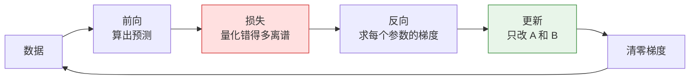

# 微调大模型入门（最简单的一份）

## 引入

你已经在用 Claude Code，知道大模型能读文件、能调用工具（function call）、能通过 MCP 连外部服务。这些能力**都不是你改出来的**——你只是写提示词，模型本身一个字节都没变。

那如果我想让它稳定地按我要求的方式输出呢？比如：

- 我的 CAD 插件里有一批内部约定的写法，希望模型每次都按这个风格给代码
- 我要它从图纸信息里抽出数据，每次都必须吐同一套 JSON 结构的字段

提示词能办到七八成，但**写法要写得很长，而且不稳定**——同一个问题上问十次，格式可能飘三次。

微调（fine-tuning）就是另一条路：**不改提示词，改模型自己**。代价是要自己拿数据训练一遍。

>[!important] 一句话定位
>提示词是"每次考试前给考生递小抄"，微调是"让考生自己去练一段时间，把小抄背下来"。
>小抄可以随时换，练过的本事换不掉——各自有各自的适用场景，不是谁替代谁。

---

## 一、先分清三条路

这是新手最容易搞混的地方，先立起来：

| 做法 | 改了什么 | 成本 | 适合解决的问题 |
| --- | --- | --- | --- |
| **提示词** | 什么都不改，只是输入更长 | 几乎为零 | 通用任务、一次性任务 |
| **RAG（外挂检索）** | 不改模型，改的是"先查资料再回答" | 中（要搭检索） | **知识**：你公司的内部文档、规格书 |
| **微调** | 真的改了模型内部的参数 | 高（要数据 + GPU + 训练） | **习惯 / 风格 / 格式**：说话方式、输出结构、固定套路 |

>[!warning] 最容易搞反的一点
>**微调管的是"习惯"，不是"知识"。**
>你拿 200 条公司文档去微调，想让模型记住文档内容——大概率失败，而且文档一更新就得重训。
>正确做法是：知识交给 RAG（查得到就行），微调只负责"让它按我要的样子组织语言和结构"。
>微调的目标是让模型学会**"遇到这类输入，就按这个套路输出"**这种条件反射。

---

## 二、模型里到底有什么东西可以被"改"

### 参数就是一堆矩阵

模型内部的所有"知识"都存在叫**参数**的东西里，参数基本上全都是**矩阵和向量**。

拿最小的一层来举例，一层做的是这么一件事：

$$
h = W x + b
$$

- $x$ 是输入向量，长度 $k$
- $W$ 是一个 $d \times k$ 的矩阵（这就是**参数**）
- $b$ 是长度 $d$ 的偏置向量
- $h$ 是输出向量，长度 $d$

>[!info]- 用你已经会的东西理解
>这一步就是**坐标变换**：把 $k$ 维空间里的一个点，映射到 $d$ 维空间里的另一个点。
>你做过坐标系转换——把点从世界坐标系换算到图纸坐标系，本质上就是乘一个矩阵然后加个平移量。$Wx + b$ 是同一件事。
>区别只在于：CAD 里的变换矩阵是"人设计好的、有几何意义"的；这里的 $W$ 是**训练出来的，没有直观几何意义**，但数学上干的是同一件事。

一个真实的模型，就是这样的层叠几十层、每层里还有好几个矩阵，中间再插一些非线性的小函数。所谓"大模型"，"大"就大在这些矩阵的数量上。

| 模型规模 | 参数量 | 用 16 位浮点存（每个参数 2 字节）要多少内存 |
| --- | --- | --- |
| 小 | 0.6B（6 亿） | 约 1.2 GB |
| 中 | 1.5B | 约 3 GB |
| 大 | 7B | 约 14 GB |
| 很大 | 70B | 约 140 GB |

>[!note] 单位说明
>B = billion = 十亿。1.5B 参数就是 15 亿个数字。**光是"把模型装进显存"**，7B 模型就要 14GB。
>而这只是**起点**——训练时还要额外的东西，下一节说。

### 前向传播：一次问答就是一趟矩阵接力

输入一句话 → 切成 token（词块）→ 每个 token 变成一个向量 → 一层层 $Wx+b$、非线性、再 $Wx+b$⋯⋯ → 最后算出一个"下一个词是啥"的概率分布。

**这整个过程里，没有任何参数被改变。** 模型跑得再多，也不会自己学到东西。要让它变，必须专门跑训练。

---

## 三、全量微调：为什么它很贵

最直接的做法叫**全量微调（full fine-tuning）**：把上面说的所有矩阵都拿去训练，每个数字都可以动。

问题是训练一个参数，不止要存它自己。粗略算，**每个参数在训练时要占大约 12~16 字节**：

| 占显存的项 | 每个参数字节 | 为什么需要 |
| --- | --- | --- |
| 模型的权重（16 位） | 2 | 模型本身 |
| 权重的高精度副本（32 位） | 4 | 更新时必须用高精度算，否则精度会被磨掉 |
| 梯度 | 2 | "每个参数该往哪边调、调多少" |
| 优化器状态（Adam 的两份动量） | 8 | 优化器要记历史趋势，两份 32 位数组 |
| **合计** | **约 16** | 还没算中间的激活值、临时缓冲区 |

所以在用 Adam 优化器的混合精度训练里，**1.5B 模型全量微调大概要 20GB 以上显存**，7B 要 80GB 以上（这就是为什么大家用 A100/H100 集群）。

>[!warning] 结论
>全量微调不是"能不能写对代码"的问题，是"有没有这个硬件"的问题。对个人来说，这条路基本可以不看了。
>下面的 LoRA 才是个人能玩的。

---

## 四、LoRA：不重画底图，只加一个覆盖图层

### 用 CAD 类比先建立直觉

你在 CAD 里改图，从来不会去改底图的一根线。你会**新建一个图层**，把要改的地方画在上面，需要的时候叠加显示，底图原封不动。

LoRA（Low-Rank Adaptation，低秩适配）就是这个思路：

- **底图（原模型的全部参数）= 冻结（frozen）**，训练时一个数字都不动
- **新图层（一小撮新参数）= 可训练**，只训练这些
- 用的时候把两者叠加：**最终效果 = 底图 + 图层**

### 数学上是怎么"加图层"的

原来的前向传播：

$$
h = Wx
$$

加了 LoRA 之后：

$$
h = Wx + \frac{\alpha}{r} B A x
$$

其中：

- $W$ 是原来的 $d \times k$ 矩阵（**冻结，不训练**）
- $A$ 是一个 $r \times k$ 的小矩阵（**要训练**）
- $B$ 是一个 $d \times r$ 的小矩阵（**要训练**）
- $r$ 是一个很小的数，一般取 8 / 16 / 32，这叫 **秩（rank）**
- $\alpha$ 是个缩放系数，一般设成 $2r$，用于控制"图层"的影响强度

关键在于 $B A$ 这个乘积：$B$ 是 $d \times r$，$A$ 是 $r \times k$，乘出来是 $d \times k$——**和 $W$ 一样大**，可以直接相加。

但训练的参数只有 $A$ 和 $B$ 里的数字，数量是 $r \times k + d \times r$，而不是 $d \times k$。

### 参数量差多少：算一笔账

假设 $d = k = 4096$（7B 模型里典型的一层），$r = 8$：

| 方案 | 训练哪些参数 | 可训练参数量 | 占比 |
| --- | --- | --- | --- |
| 全量微调 | 整个 $W$ | $4096 \times 4096 = 1677$ 万 | 100% |
| LoRA (r=8) | 只有 $A$ 和 $B$ | $8 \times 4096 + 4096 \times 8 = 65536$ | **约 0.4%** |

一边是 1677 万个数字要训练，一边是 6.5 万个。整个模型上，LoRA 通常只训练**全部参数的 0.1% ~ 1%**。

>[!info]- 为什么这招有效（一句话版）
>微调学到的改变量 $\Delta W = BA$ 是很"低秩"的——大部分微调任务需要的改动，其实用很窄的一组方向就够表达了。
>好比一张图要调色，不需要重新画每个像素，只要调几个整体参数（对比度、色温）就够了。LoRA 就是给每个矩阵配了一组这样的"调色旋钮"。

### 两个必须知道的细节

>[!note] 细节一：初始时"图层"是空的
>训练开始前，$A$ 用小随机数初始化，**$B$ 全部初始化为 0**。
>这样 $BA = 0$，于是 $h = Wx + 0 = Wx$——**模型一开始的行为和原模型一模一样**，微调是从"完全不影响原模型"这个状态出发的。
>（如果两边都随机初始化，训练第一步模型就会开始说胡话。）

>[!note] 细节二：推理时可以合并，不增加延迟
>训练完得到 $A$、$B$ 之后，可以算 $W' = W + \frac{\alpha}{r}BA$ 塞回原模型，得到一个"已经学会了新习惯"的同尺寸模型。
>也可以不合并，推理时保留两个分支（稍微慢一点点，但可以随时换不同图层）。
>**图层可以单独存文件**——一个 LoRA 适配器通常只有几十到几百 MB，底图 3GB 不用重存。

### 形状追踪表（跟你在散列表里追踪探测链是一个意思）

输入 $x$ 是一条长度为 $k$ 的向量，追踪它经过 LoRA 分支的每一步：

| 步骤 | 张量 | 形状 | 说明 |
| --- | --- | --- | --- |
| 0 | $x$ | $[k]$ | 输入向量 |
| 1 | $Ax$ | $[r]$ | 先用 $A$ 把 $k$ 维**压**到 $r$ 维（r 很小，严重压缩） |
| 2 | $B(Ax)$ | $[d]$ | 再用 $B$ 把 $r$ 维**升**回 $d$ 维 |
| 3 | $Wx$ | $[d]$ | 原来那条路，形状对得上 |
| 4 | $Wx + \frac{\alpha}{r}BAx$ | $[d]$ | 两个 $[d]$ 向量相加，这就是这一层的输出 |

>先降维再升维，中间那个很窄的 $r$ 就是"瓶颈"。这个结构叫**低秩**——$BA$ 这个矩阵的秩最多只有 $r$。

---

## 五、训练的时候到底在算什么

### 一个训练 step 的五步循环

```
输入一条数据（比如：问题 + 标准答案）
    ↓
① 前向传播：把问题喂进去，模型逐 token 预测下一个词
    ↓
② 算损失 loss：模型给"标准答案"里每个词打了多少分？打了低分就罚它
    ↓
③ 反向传播：算出"每个可训练参数应该往哪个方向调、调多少"（梯度）
    ↓
④ 优化器更新：按梯度往反方向挪一小步（只挪 A 和 B，W 不动）
    ↓
⑤ 梯度清零，取下一批数据，回到 ①
```



### 损失（loss）是什么

模型在每个位置输出的不是一个词，而是"整个词表里每个词的概率"。正确答案是"张"，模型给"张"这个词打了 0.9 的概率，那就没怎么错；只打了 0.05，那就要重罚。

衡量方式叫**交叉熵**，写法是：

$$
\text{loss} = -\log(\text{模型给正确答案的概率})
$$

| 模型给正确答案的概率 | loss | 感受 |
| --- | --- | --- |
| 1.0（完全猜对） | 0 | 完美 |
| 0.5 | 0.69 | 还行 |
| 0.1 | 2.30 | 错得比较明显 |
| 0.01 | 4.60 | 离谱 |

>[!info]- 为什么取 log 再取负
>概率越接近 0，$-\log$ 越爆炸式地增大，所以"自信地答错"会被罚得特别狠。
>另外因为 $\log(ab) = \log a + \log b$，一整句话的总损失就等于**每个词损失的乘积变成了加法**——这就是为什么这里要用 log 而不是直接用概率。

**训练前** loss 一般在 2~3 左右（模型基本在瞎猜），**训好了**能降到 0.1~0.5。这个数字是你唯一需要盯的仪表盘。

### 梯度下降：用你已经学过的东西理解

你已经学过多元函数和偏导数：一个函数对某个变量的偏导，表示"这个变量动一点点，函数值变化多少"。

把所有参数（这里是 $A$ 和 $B$ 里的每个数字）的偏导摆成一个向量，就是**梯度**。梯度指向的是"loss 上升最快的方向"。那我们想降低 loss，就**往梯度的反方向走一小步**：

$$
\theta \leftarrow \theta - \eta \cdot \nabla L(\theta)
$$

- $\theta$：所有可训练参数（LoRA 里就是 $A$ 和 $B$）
- $\eta$：**学习率**，就是步长
- $\nabla L$：梯度，指示方向

>[!warning] 学习率是新手第一个会踩的坑
>- **太大**：一步跨过山谷，来回震荡，loss 不降反升，甚至变成 `nan`（模型说胡话，输出乱码）
>- **太小**：loss 降得跟蜗牛一样，或者卡在一个小坑里出不来
>
>典型值：**LoRA 用 1e-4 到 2e-4**（也就是 0.0001~0.0002）。
>注意这个值比全量微调（1e-5 量级）**大十倍左右**——因为 LoRA 是新建的小矩阵、从零开始学，需要大刀阔斧；而全量微调动的是已经很聪明的原参数，只能轻手轻脚。

### 三个必备词汇

| 词 | 意思 | 类比 |
| --- | --- | --- |
| **batch（批）** | 一次前向同时喂几条数据 | 一次搬几块砖 |
| **step（步）** | 跑完一次"前向→更新"，参数动了一次 | 搬一趟砖 |
| **epoch（轮）** | 把训练集完整过一遍 | 把整堆砖搬完一圈 |

如果显存装不下大 batch，就用 **梯度累积（gradient accumulation）**：一次算 1 条，把梯度攒 8 次再更新一次——效果约等于 batch=8，代价是慢。

### 训练过程跟踪表（用来看自己训得对不对）

数据量 200 条、batch=1、累积 8 步、3 轮的话，大约 75 个 step。你在日志里应该看到这样的**量级**：

| step | 模型在干什么 | 典型 loss | 该不该慌 |
| --- | --- | --- | --- |
| 0（还没训） | 瞎猜 | 2.0 ~ 3.0 | 正常，这是起点 |
| 10 | 开始摸到格式了 | 1.0 ~ 1.6 | 正常，降得很快 |
| 30 | 在学套路 | 0.5 ~ 0.9 | 正常 |
| 75（训完） | 背下来了 | 0.1 ~ 0.4 | 正常 |
| — | — | **0.01 以下 + 验证集 loss 开始上升** | ⚠️ 过拟合了，看第八节 |

>这张表的数字是**数量级参考**，不是标准答案。你的具体数值取决于数据难度、条数、学习率。
>关键是**趋势**：整体向下、不要剧烈抖动、最后不要掉到 0.0x 还继续往下冲。

---

## 六、数据长什么样

>[!tip] 已经给你写好一份可直接用的
>`cad-train.jsonl`（20 条 CAD 插件开发场景）+ 可读版说明 [[CAD场景微调数据样例]]。
>先拿它把流程跑通，再换成你自己的数据。

### 格式：JSONL（一行一条 JSON）

训练数据是一个 `.jsonl` 文件，**每行是一个完整独立的 JSON，行尾不能有逗号**（和普通 JSON 数组不一样，这是为了能流式读取大文件）。

最常用的字段约定是三个：

```jsonl
{"instruction": "把点关于 X 轴镜像", "input": "(3, 5)", "output": "(-3, 5)"}
{"instruction": "把点关于 X 轴镜像", "input": "(-2, 7)", "output": "(-2, -7)"}
{"instruction": "判断两个向量是否垂直", "input": "a=(1,2), b=(-4,2)", "output": "垂直，因为点乘 = 1×(-4) + 2×2 = 0"}
```

- `instruction`：要它干什么（指令）
- `input`：这次的具体输入，**可以留空字符串**
- `output`：你期望它输出的标准答案 ← **模型学的就是这个**

>[!warning] 数据质量比数量重要得多
>- **200~500 条写得干净、格式统一的数据**，就能看出明显效果
>- 1000 条风格混乱、格式不统一的数据，只会让模型学成四不像
>- 每一条 `output` 的**结构必须高度一致**（比如都是同样的标题层级、同样的 JSON 字段）。模型是从**重复的模式**里学"习惯"的，你给它 5 种不同风格，它就学到 5 种混乱
>
>**你的第一条数据决定了它的调性，后面每条都在强化或稀释这个调性。**

### 模型真正看到的东西

训练时这些字段会被拼成一段带标签的文字，模型就是在**预测这句话里每一个下一个词**。拼完大概长这样：

```
<|im_start|>system
你是CAD插件开发助手。<|im_end|>
<|im_start|>user
把点关于 X 轴镜像
(3, 5)<|im_end|>
<|im_start|>assistant
(-3, 5)<|im_end|>
```

>[!note] 为什么只学答案部分
>上面的模板标签（`<|im_start|>` 之类）是模型自带的固定格式，不用你操心，`apply_chat_template` 会自动加。
>训练时一般会**把问题部分的 loss 屏蔽掉**（只对 `assistant` 那段的词算 loss），因为模型不需要学"怎么提问"，只需要学"怎么回答"。

### 一定要切出验证集

把数据分成两份：**训练集**去训，**验证集**（留 10%~20%，比如 200 条里留 20 条）**只用来测试，绝不参与训练**。

原因：如果训练集和验证集是同一批数据，你没法区分模型是"学会了套路"还是"把答案背下来了"。验证集是唯一能看出**过拟合**的手段——见第八节。

---

## 七、动手：一次最小的 LoRA 微调

### 选型

| 选择 | 选什么 | 为什么 |
| --- | --- | --- |
| 方法 | **LoRA** | 个人硬件唯一现实的选择，够用 |
| 模型 | **Qwen2.5-1.5B-Instruct**（中文好、够小）；显存 ≤8GB 就选 **Qwen2.5-0.5B** 或加 QLoRA | 单卡就能跑；中文任务不用挑 Llama |
| 框架 | **transformers + peft + trl**（脚本路线）或 **LLaMA-Factory**（界面路线） | 前者透明、能看懂每一步；后者零代码 |

>[!info]- 显存参考
>- 1.5B + LoRA（16 位）：约 8~10 GB
>- 1.5B + **QLoRA**（底图压缩成 4 位再训 LoRA）：约 4~6 GB，消费级显卡能跑，效果损失很小
>- 7B + QLoRA：约 12~16 GB

### 路线 A：脚本路线（推荐先看这个）

**第 1 步：建环境**

```bash
conda create -n ft python=3.11 -y
conda activate ft

# 先确认驱动正常（显卡机器上应该有输出）
nvidia-smi

pip install torch --index-url https://download.pytorch.org/whl/cu124
pip install transformers peft trl datasets accelerate
```

>PyTorch 装错 CUDA 版本是最常见的翻车点。装完跑一句 `python -c "import torch; print(torch.cuda.is_available())"`，必须打印 `True`。

**第 2 步：准备数据**

建一个 `train.jsonl`，按第六节的格式，**先写 20 条**把自己的流程跑通，再扩到 200 条。

懒得从头写就直接用 `cad-train.jsonl`（见 [[CAD场景微调数据样例]]），把脚本里的 `data_files="train.jsonl"` 改成它即可。

**第 3 步：训练脚本 `train.py`**

```python
import torch
from datasets import load_dataset
from peft import LoraConfig
from transformers import AutoModelForCausalLM, AutoTokenizer
from trl import SFTConfig, SFTTrainer

MODEL_ID = "Qwen/Qwen2.5-1.5B-Instruct"

# ---------- 1. 加载模型和分词器 ----------
tokenizer = AutoTokenizer.from_pretrained(MODEL_ID)
model = AutoModelForCausalLM.from_pretrained(
    MODEL_ID,
    dtype="bfloat16",         # 用 16 位存权重，省一半显存
    device_map="auto",        # 自动放到显卡上
)

# ---------- 2. 把 jsonl 拼成模型看得懂的文本 ----------
dataset = load_dataset("json", data_files="train.jsonl", split="train")

def to_text(example):
    messages = [
        {"role": "system", "content": "你是CAD插件开发助手。"},
        {"role": "user", "content": example["instruction"] + "\n" + example["input"]},
        {"role": "assistant", "content": example["output"]},
    ]
    return {"text": tokenizer.apply_chat_template(messages, tokenize=False)}

dataset = dataset.map(to_text)

# ---------- 3. 配置 LoRA ----------
lora_config = LoraConfig(
    r=8,                      # 秩。越大越能学，也越容易过拟合。8/16 起步
    lora_alpha=16,            # 缩放系数，一般 = 2 * r
    lora_dropout=0.05,        # 随机丢弃，防过拟合
    target_modules=["q_proj", "k_proj", "v_proj", "o_proj"],  # 给哪些矩阵加"图层"
    task_type="CAUSAL_LM",
)

# ---------- 4. 训练 ----------
trainer = SFTTrainer(
    model=model,
    train_dataset=dataset,
    peft_config=lora_config,
    args=SFTConfig(
        output_dir="./out",
        dataset_text_field="text",
        max_length=1024,
        num_train_epochs=3,               # 数据少就多跑几轮
        per_device_train_batch_size=1,    # 显存小就用 1
        gradient_accumulation_steps=8,    # 攒 8 步更新一次，等效 batch=8
        learning_rate=2e-4,               # LoRA 的典型值
        logging_steps=1,                  # 每个 step 都打印 loss
        save_strategy="epoch",
        bf16=True,
        report_to="none",
    ),
)

trainer.train()
trainer.save_model("./lora-out")          # 只存 A 和 B，几十到几百 MB
```

**第 4 步：跑起来，盯 loss**

```bash
python train.py 2>&1 | tee train.log
```

对照第五节的跟踪表看 loss 有没有正常下降。**第一次就成功的人很少，出问题看第九节。**

**第 5 步：测试它学到了什么**

```python
from peft import PeftModel
from transformers import AutoModelForCausalLM, AutoTokenizer

MODEL_ID = "Qwen/Qwen2.5-1.5B-Instruct"
tokenizer = AutoTokenizer.from_pretrained(MODEL_ID)

# 先看原模型怎么答（对照组）
base = AutoModelForCausalLM.from_pretrained(MODEL_ID, dtype="bfloat16", device_map="auto")
question = "把点关于 X 轴镜像\n(3, 5)"
msgs = [{"role": "user", "content": question}]
prompt = tokenizer.apply_chat_template(msgs, tokenize=False, add_generation_prompt=True)
inputs = tokenizer(prompt, return_tensors="pt").to(base.device)
out = base.generate(**inputs, max_new_tokens=64, do_sample=False)
print("原模型:", tokenizer.decode(out[0][inputs["input_ids"].shape[1]:], skip_special_tokens=True))

# 再换成微调后的
model = PeftModel.from_pretrained(base, "./lora-out")
out = model.generate(**inputs, max_new_tokens=64, do_sample=False)
print("微调后:", tokenizer.decode(out[0][inputs["input_ids"].shape[1]:], skip_special_tokens=True))
```

>[!note] 怎么看结果
>- 微调后输出**格式变得跟你的 output 一模一样**了 → 成功了
>- 两个输出几乎一样 → 说明没学到东西（查第九节"训了个寂寞"）
>- 微调后开始胡说八道、忘记常识 → 灾难性遗忘或学习率太大

**第 6 步（可选）：合并导出**

想脱离 peft 直接用一个模型：

```python
merged = model.merge_and_unload()      # 算 W' = W + (alpha/r)·BA
merged.save_pretrained("./merged-model")
```

### 路线 B：LLaMA-Factory（不想写代码就用这个）

有 Web 界面，所有参数在网页上填，数据和模型路径一选就能开跑。项目更新较快，以它的 README 为准：

```bash
conda create -n llamafactory python=3.11 -y
conda activate llamafactory
git clone --depth 1 https://github.com/hiyouga/LLaMA-Factory.git
cd LLaMA-Factory
pip install -e ".[torch,metrics]"

llamafactory-cli webui      # 浏览器打开提示的地址
```

界面里对应本教程的知识点：

| 界面上的选项 | 对应本文哪里 |
| --- | --- |
| 模型名称 / 数据集 | 选 Qwen2.5 和你的 jsonl |
| 微调方法：`lora` | 第四节 |
| `lora_rank` = 8 | 第四节的 $r$ |
| `lora_target` = all | 给哪些矩阵加图层 |
| `learning_rate` = 2e-4 | 第五节 |
| `num_train_epochs` = 3 | 第五节 |

>[!tip] 建议先用 LLaMA-Factory 跑通一次（看得到 loss 曲线、不容易在环境上翻车），
>再回头用路线 A 的脚本跑一遍——那时你就知道每个参数在干什么了。

---

## 八、跑完之后：怎么判断成功

| 看什么 | 健康的信号 | 危险的信号 |
| --- | --- | --- |
| 训练集 loss | 平稳下降到 0.1~0.5 | 掉到 0.01 还在降 |
| **验证集 loss** | 跟训练集一起降，最后走平 | **开始往上翘**（过拟合的分界线） |
| 输出格式 | 稳定符合你的 `output` 格式 | 时好时坏 |
| 输出内容 | 换了没见过的输入也能正确应对 | **原封不动复读训练集里的某一条** |
| 通用能力 | 还能正常聊天、答别的题 | 除了你的任务什么都不会了 |

>[!warning] 过拟合：数据少的任务最容易撞的墙
>表现：训练集 loss 一路降到 0.02，但验证集 loss 从某个点开始往上走，而且你问它没见过的输入，它把训练集里的某条答案背了出来。
>
>意思是：**它把答案背下来了，但没学会套路。**
>
>三个解法（按推荐顺序）：
>1. **加数据**——200 条加到 500 条，这是最有效的
>2. **减训练量**——`num_train_epochs` 从 3 降到 1，或者加 `early_stopping`
>3. **减小 $r$**——从 8 降到 4，减小"图层"的表达能力

>[!warning] 灾难性遗忘
>学新习惯的时候，把原来的本事弄丢了——比如微调完不会正常聊天了，或者中文变差了。
>原因：参数被拉得太远。解法是**降低学习率**、**减少训练轮数**、**只训 attention 层**（`target_modules` 里去掉 MLP 部分）。

---

## 九、常见翻车现场

| 现象 | 原因 | 怎么修 |
| --- | --- | --- |
| 训完了一点变化都没有 | `target_modules` 名字写错了，没匹配到任何一层 | 打印层名核对（见下面） |
| 训练 loss 一直不动 | 学习率太小 / 数据格式没拼对 | 先 `print(dataset[0]["text"])` 看模型到底看到了什么 |
| loss 变成 `nan` | 学习率太大 | 降到 1e-4 或 5e-5，开 `bf16` |
| 显存爆了（OOM） | batch 太大 / 模型太大 | `batch=1` + 梯度累积；换小模型；上 QLoRA |
| 输出格式忽好忽坏 | 训练数据里格式不统一 | 回头统一每一条 `output` 的结构 |
| 只会回答训练集里见过的题 | 过拟合 | 见第八节 |

**核对 target_modules 的层名**（记不住名字就直接打印出来）：

```python
import torch
for name, module in model.named_modules():
    if isinstance(module, torch.nn.Linear):
        print(name)
```

>不同模型系列的层名不一样（Qwen2 是 `q_proj`/`k_proj`/`v_proj`/`o_proj`/`gate_proj`/`up_proj`/`down_proj`）。
>`lora_target` 写成 `all` 或 `all-linear` 一般会帮你匹配全部线性层，最省心。

>[!tip] 排查顺序：先证明数据对 → 再证明层对 → 最后才怀疑超参数。
>90% 的"训了没效果"是前两个问题，不是学习率的问题。

---

## 十、附：给 C# 程序员的 Python 速读对照

>[!warning] 关于"只用 C#"这条规矩
>微调的整个生态（PyTorch、transformers、peft、trl、LLaMA-Factory）**是纯 Python 的**，没有可用的 C# 替代方案——
>这不是偷懒，是这个领域的事实（就像 CAD 二次开发只能围着那几套 SDK 转）。
>所以这篇笔记里的 Python，请你把它当成**"有具体语法的伪代码"**来读。下面这张表扫一眼就够，不用专门学 Python。

| Python | C# 里的对应物 |
| --- | --- |
| 靠**缩进**分层 | 靠 `{ }` 分层。看到缩进变深 = 进了一个块 |
| `def f(a, b=1):` | `void F(int a, int b = 1)` |
| `x: int = 5` | `int x = 5;`（Python 的类型标注只是提示，运行时不检查） |
| `[1, 2, 3]` | `new List<int> { 1, 2, 3 }` |
| `{"a": 1, "b": 2}` | `new Dictionary<string, int> { ["a"] = 1, ["b"] = 2 }` |
| `f"{name} 岁"` | `$"{name} 岁"`（f-string ≈ 字符串插值） |
| `with open(f) as x:` | `using (var x = File.OpenRead(f))` |
| `for k, v in d.items():` | `foreach (var kv in dict)` 然后取 `kv.Key` / `kv.Value` |
| `lambda x: x + 1` | `x => x + 1` |
| `import torch` | `using Torch;` |
| `pip install X` | `dotnet add package X`（NuGet） |
| `conda create -n ft` | 新建一个独立的项目环境，避免依赖互相污染 |
| `@decorator` | 特性（Attribute），但 Python 的装饰器**会在运行时真的包一层函数**，不只是元数据 |
| `model.train()` / `model.eval()` | 设置一个模式开关，影响 dropout 等行为——很像 CAD 里开关一个事务上下文 |

>看脚本的诀窍：**从上往下读，先把 `import` 和常量看过去，从 `trainer.train()` 往回找每个参数是在哪里定义的。** 不要试图理解每一行。

---

## 闪卡

#AI-flashcards

微调改的是模型的==1;;参数（权重）==，提示词和 RAG 都不改模型本身。微调适合学**习惯/风格/格式**，知识类的需求应该用==1;;RAG==。

LoRA 的前向传播公式 $h = Wx + \frac{\alpha}{r}BAx$，其中**冻结不训练**的是::W||$W$（原模型的大矩阵）

LoRA 里的 $A$ 是 $r \times k$、$B$ 是 $d \times r$，$r$ 一般取::8 或 16

LoRA 训练开始时 $B$ 为什么要初始化为全 0？
?
- 这样 $BA = 0$，模型输出就等于原模型 $Wx$，**微调从"完全不影响原模型"的状态出发**。
- 如果 $A$、$B$ 都随机初始化，训练第一步模型输出就会变得乱七八糟，等于从一个坏掉的模型开始训。

为什么 LoRA 只用不到 1% 的参数就能有效果？
- 因为微调需要的改变量 $\Delta W$ 是==1;;低秩==的，用很窄的一组方向（$r$ 维瓶颈）就足够表达了。
- 直观类比：调一张图的颜色不需要重画每个像素，只需调几个整体参数。

训练一个 step 的五个环节::前向传播 → 算 loss → 反向传播求梯度 → 优化器更新参数 → 梯度清零

损失函数 $-\log(\text{正确答案的概率})$ 中，模型给正确答案概率 0.1 时 loss 约等于::2.3（$-\log 0.1 \approx 2.3$）

梯度下降的更新公式 $\theta \leftarrow \theta - \eta \nabla L$ 中，$\eta$ 叫==1;;学习率（步长）==，LoRA 的典型取值是==1;;1e-4 ~ 2e-4==，比全量微调的 1e-5 量级==1;;大十倍左右==。

学习率太大 / 太小的后果分别是什么？
?
- 太大：来回震荡，loss 不降反升，甚至变成 `nan`（模型开始说胡话）
- 太小：下降极慢，或者卡在局部小坑里出不来

batch / step / epoch 三个词的区别::batch 是一次同时喂几条数据；step 是参数更新一次；epoch 是把训练集完整过一遍

LoRA 显存比全量微调省在哪？全量微调每个参数要占多少字节？
- 全量微调要同时存权重(2)、高精度副本(4)、梯度(2)、优化器状态 Adam 两份动量(8)，共==1;;约 16 字节/参数==。
- LoRA 只对 A、B 训练，所以梯度、优化器状态的量从"全部参数"降到==1;;0.1%~1% 的参数==，只有基础权重需要常驻显存。

训练数据用什么格式？三个常用字段是什么::`.jsonl`（一行一条 JSON）；`instruction` / `input` / `output`

判断过拟合的两个信号是什么？怎么解决？
- 信号：==1;;训练集 loss 还在降，但验证集 loss 开始往上翘==；以及问没见过的输入时==1;;原封不动复读训练集里的答案==。
- 解决（按推荐顺序）：加数据（最有效）→ 减少 epoch → 减小 $r$。

微调后模型除了目标任务什么都不会了，这个现象叫什么？怎么缓解？
- 叫==1;;灾难性遗忘==，学新习惯把原来的本事弄丢了（参数被拉得太远）。
- 缓解：降低学习率、减少训练轮数、只在 attention 层挂 LoRA（`target_modules` 去掉 MLP 层）。
