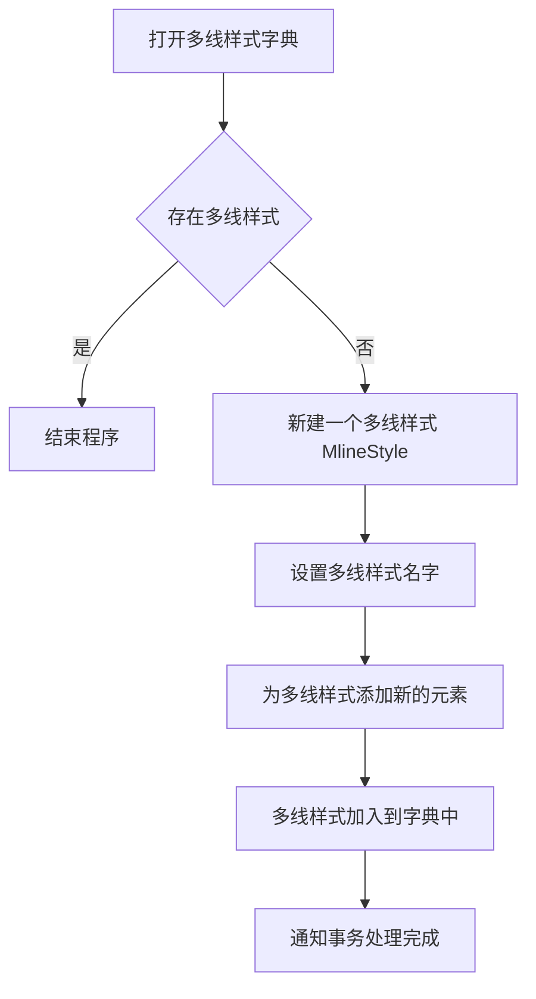

## 概述

AutoCAD 提供了多种为实体或数据库附加自定义信息的方式，主要分为两类：

- **扩展数据（XData）**：轻量级，直接“贴”在实体上，但有 16KB 容量限制。
    
- **字典机制**：无容量限制，结构更灵活。包含：
    
    - **扩展字典**：每个实体只有一个，可存放任意 `DBObject`（如 `XRecord`）。
        
    - **有名对象字典**：数据库级别的“根字典”，存放与应用或全局相关的字典项（如组字典、多线样式字典等）。
        
    - **组与多线样式字典**：它们实际就是有名对象字典中的特定条目，分别管理实体编组和多线样式。
        

## 1. CAD扩展数据（XData）

### 1.1 基本概念

- XData 可以附加到**任何数据库对象**（不仅是实体）上，为对象提供额外信息。
    
- 数据随 DWG 文件一起保存，但 AutoCAD 本身不解析其内容，仅负责维护。
    
- **容量限制**：每个实体的 XData 总大小不超过 **16 KB**。多个应用程序可能维护同一个实体的 XData，限制容量是为了防止实体加载时因冗余数据过多而拖慢速度。

### 1.2 添加扩展数据
#### 构造数据
给实体添加扩展记录是通过实体的XData属性指定的，类型是ResultBuffer，有两种公开的实例化方法（构造函数）

```csharp
// 方法一：先创建空 ResultBuffer，再 Add
ResultBuffer rb = new ResultBuffer();
rb.Add(new TypedValue((int)DxfCode.ExtendedDataRegAppName, "MyApp"));
rb.Add(new TypedValue((int)DxfCode.ExtendedDataAsciiString, "一些文本"));

// 方法二：通过 params 参数直接传入
ResultBuffer rb = new ResultBuffer(
    new TypedValue((int)DxfCode.ExtendedDataRegAppName, "MyApp"),
    new TypedValue((int)DxfCode.ExtendedDataAsciiString, "一些文本")
);
```

%% 选择集中的过滤集也是接收TypedValue对象作为参数，不同的是SelectionFilter接收的是TypedValue数组。 %%

#### 注册应用程序名

在附加 XData 前，必须在 `RegAppTable`（应用程序名注册表）中登记 AppName：

1. 打开 `RegAppTable`。 
    
2. 检查是否存在同名记录（类似其他符号表的处理，但 `ViewportTable` 例外）。
    
3. 若不存在，则 `Add` 新记录。
    
4. 事务提交。
    

#### 附加到实体

登记完成后，通过 `entity.XData = rb;` 即可附加数据。


### 1.3 数据类型与组码

XData 中的数据类型使用 `DxfCode` 枚举，以 `ExtendedData` 开头：

|组码|含义|
|---|---|
|`ExtendedDataRegAppName` (1001)|应用程序名称|
|`ExtendedDataAsciiString` (1000)|字符串|
|`ExtendedDataLayerName` (1003)|图层名|
|`ExtendedDataReal` (1040)|实数|
|`ExtendedDataInteger16` (1070)|16 位整数|

> **提示**：扩展数据组码与普通 DXF 组码不同，使用时需注意区分。

### 1.4 扩展数据的数据结构

每一段XData都必须以组码1001开头，1001对应的就是应用程序名称。

CAD添加多段扩展数据的逻辑是，检查传入的ResultBuffer的AppName，仅替换或新增提到的这个AppName下的数据段。

因此展开XData的结果视图，能看到如下的数据结构
```
{ 1001, "MyApp1" }  <-- 就像一个文件夹标签
{ 1000, "数据A" }
{ 1040, 1.23 }
{ 1001, "MyApp2" }  <-- 另一个文件夹标签
{ 1070, 45 }
```
这种设计实现了”多应用共享同一实体 XData”的隔离。

### 1.5 如何使用鼠标停留提示显示扩展记录中的信息

Editor类下的PointMonitor，这个事件是当鼠标在绘图区移动时就会触发，

利用 `Editor.PointMonitor` 事件在光标停留处显示扩展数据：

1. 订阅 `Editor.PointMonitor` 事件。
	`ed.PointMonitor += new PointMonitorEventHandler(ed_PointMonitor);`
	
2. 写触发事件时调用的方法
	- `void ed_PointMonitor(object sender,PointMonitorEventArgs e)`
	- 事件参数 `PointMonitorEventArgs` 提供：
	    - `e.Context.GetPickedEntities()`：返回当前光标下命中的实体路径（`FullSubentityPath`），即命中的实体，从最外层对象一路走到最终被命中的对象，路径是什么。例如块内的圆会返回 `[BlockReferenceId, CircleId]`。    
    - `AppendToolTipText(string)`：向光标提示框追加文本。
        
3. 调用 `GetXDataForApplication(regAppName)` 取出指定应用的 XData，格式化为字符串后追加到提示文字。

## 2. 使用扩展字典和有名对象字典

### 2.1 为什么使用字典

与 XData 相比，字典机制的优势：
- **无容量限制**。
- **支持任意数据类型**，不仅是基本类型和图层名，还可以存放 `DBObject`（如 `XRecord`、`DBDictionary` 等）。
- 每个对象**只能拥有一个扩展字典**，但字典内可以存放多个条目。

### 2.2 在扩展字典中添加扩展记录的步骤（Extension Dictionary）

#### 添加扩展记录的步骤

1. 为实体创建扩展字典（实体默认不存在扩展字典）：
    entity.CreateExtensionDictionary();
    
2. 通过 `entity.ExtensionDictionary` 获取字典 `ObjectId`，打开字典对象。
    
3. 创建 `XRecord`（无参构造）。
    
4. 向 `XRecord.Data` 赋值（`ResultBuffer` 类型），组码使用 **标准 DXF 组码**（如 `1`、`40`），而非扩展数据专用组码。
    
5. 调用字典的 `SetAt(searchKey, xrecord)` 加入记录。
    
    > 注意：字典的 key 不允许重复，添加前需检查是否存在。

`XRecord` 是专门存储大块自定义数据的对象，配合标准组码更通用。

### 2.3 有名对象字典（Named Objects Dictionary）

#### 有名字典是什么

1、DWG 数据库内部有一个根字典，AutoCAD 把它定义为 Named Objects Dictionary；.NET 里没有给它单独封装一个 `NamedObjectsDictionary` 类，而是用通用的 `DBDictionary` 类来表示它。

2、有名对象字典用来保存与实体无关的数据，CAD本身就使用有名对象字典来保存一些信息，例如组字典，多线样式字典等。

3、Database给了一个入口，能够获得有名字典的objectid--NamedObjectsDictionaryId

#### 在有名对象字典中添加新的字典项的基本步骤

1. 打开有名对象字典：`tr.GetObject(db.NamedObjectsDictionaryId, ...) as DBDictionary;`
    
2. 创建一个新的 `DBDictionary`（作为字典项容器）或直接创建 `XRecord`。
    
3. 为容器添加内容（如将 `XRecord` 放入新字典）。
    
4. 调用 `SetAt(key, newDict)` 将该项加入有名对象字典。

访问有名对象字典中保存的内容，在获取有名对象字典后调用字典的GetAt函数获得字典内容。

字典的大概结构
?
DBDictionary（扩展字典 / 有名对象字典）
├── "appData"  →  XRecord  {1:"hello", 40:3.14, 70:42}
├── "styles"   →  XRecord  {1:"standard", 40:2.0}
└── "sub"      →  DBDictionary
                   ├── "a" → XRecord {...}
                   └── "b" → XRecord {...}
<!--SR:!2026-05-13,2,221-->

#### 有名对象字典与符号表的比较

NamedObjectsDictionary 本质上也是一个 DBDictionary，有名对象字典与符号表在设计上非常相似：

|符号表机制|有名对象字典机制|
|---|---|
|符号表（`SymbolTable`）|`DBDictionary`（有名对象字典）|
|符号表记录（`SymbolTableRecord`）|`DBObject` 条目（如 `XRecord`、`DBDictionary`）|
|记录的 `Name` 属性|字典的 `searchKey`（键）|
|`table.Add(record)`|`dict.SetAt(searchKey, obj)`|
|通过名字查找记录|通过 key 查找字典项|

**共同点**：

- 调用 `Add`/`SetAt` 后，对象获得 `ObjectId`。
    
- 必须通过事务的 `AddNewlyCreatedDBObject` 将新对象加入事务管理。
    
- 事务提交后对象才最终存入库。
    

**区别**：

- 符号表只能存放特定类型的 `SymbolTableRecord`。
    
- `DBDictionary` 更通用，可以存放多种 `DBObject`（包括 `XRecord`、`DBDictionary` 等）。

## 3. 组字典

### 3.1 组字典介绍

- **Group 类**：位于 `DatabaseServices` 命名空间，代表一个实体编组。
- **归属字典**：所有 `Group` 对象都存储在数据库的“组字典”中，可通过 `Database.GroupDictionaryId` 获取该字典的 `ObjectId`
- **与块的区别**：组同样可以包含多个实体，但允许单独控制成员的可见性、颜色、图层等，而块实例更偏向“整体引用”。

### 3.2 Group类的构造函数原型
public Group（string description ，bool selectable）

- `description`：组的“名称”（组字典中真正的 key 是 `ObjectId` 对应的字符串，即dict.SetAt函数里传入的groupname，但构造时传入的名字会作为显示描述）。
    
- `selectable`：为 `true` 时，只要选中组中任意一个实体，整个组都会被选中；为 `false` 时实体独立选择。

无参构造等同于 `Group(null, true)`，组内无实体。

### 3.3 添加组对象到组字典中

**关键原则**：
`Group` 虽然是 `DBObject`，但创建后不会自动入库。必须先用 `SetAt` 将其放入组字典，使其获得 `ObjectId`，然后才能向其中添加实体成员。

流程：

1. 调用 `new Group(...)` 创建组。
    
2. 打开组字典GroupDictionaryId，使用 `dict.SetAt(groupName, group)` 将新组加入字典（需事先加入事务）。
    
3. 提交事务（或在新事务中）通过组的 `ObjectId` 添加实体。
    

为什么`Group` 要先入库，再往`Group` 里面加实体？
?
当实体被加入组时，组会作为**永久反应器**附加到实体上。反应器系统需要组拥有合法的 `ObjectId`，否则无法完成反向关联。
<!--SR:!2026-05-14,3,240-->

>`Group` 因为没有继承IEnumerable接口，因此不是容器，但是从表现来看，group又是一个容器。  


### 3.4 在组中加入实体和编辑组中实体

```csharp
group.Append(entityId);                // 添加单个实体
group.Append(entityIds);               // 添加多个实体
group.Clear();                         // 清空组
group.InsertAt(index, entityId);      // 插入实体
group.RemoveAt(index);                // 移除指定位置实体
group.SetColorIndex(colorIndex);      // 统一设置颜色
group.SetLayer(layerName);            // 统一设置图层
group.SetVisibility(visible);         // 统一设置可见性
// ... 等
```

### 3.5 从实体获得它所在的group

通过GetPersistentReactorIds()方法获得实体对象所拥有的永久反应器的ObjectId集合。接着可以通过LinQ对这些id进行筛选，只选择类型为Group的，便能获得实体对象所属的全部组。

>.NET API :Group plants persistent reactors on its entries when the entries are added to the group
将条目添加到分组时，对条目上的持久化反应器进行分组归类。

## 4. 多线与多线样式字典

### 4.1 多线

- 类 `Mline`，仅有无参构造。
    
- 创建后必须调用 `AppendSegment(Point3d newVertex)` 至少添加一个顶点。
    
- 需要指定 `Normal` 属性（法线方向）。
    
- 对齐方式通过 `Justification` 属性设置（`MlineJustification` 枚举：`Top`、`Zero`、`Bottom`）。

### 4.2 多线样式

多线样式定义直线的元素数量、颜色、线型、线宽、偏移量、封口样式和背景填充等。它在 .NET 中由 `MlineStyle` 类表示，存储在有名对象字典的 **`ACAD_MLINESTYLE`** 条目下，.NET封装的入口属性为 `Database.MLStyleDictionaryId`。

#### 创建多线样式步骤

1. 打开多线样式字典（`OpenMode.ForWrite`）。
    
2. 如果目标样式已存在，则结束；否则新建 `MlineStyle` 对象。
    
3. 设置样式名称。
    
4. 通过 `mlineStyle.Elements.Add(MlineStyleElement, bool)` 添加线元素。布尔参数通常为 `true`（允许继承特性）。
    
5. 调用 `dict.SetAt(styleName, mlineStyle)` 将样式加入字典。
    
6. 通过事务将对象加入数据库并提交。





#### 多线样式的删除

使用Database的RemoveMLineStyle（“style”）实例方法删除对应的多线样式
#### 设置默认多线样式


使用Database类的Cmlstyle属性，是一个可读可写的属性

因此可以设置其属性值改变默认多线样式

接着获得默认的多线样式并赋值给多线的style属性。

#### 线型

cad提供了大量的标准线型，如虚线、点画线等。

CAD中的标准线型定义文件一共有两个，分别是公制下的acadiso.lin与英制下的acad.lin
文件位置：
C:\Users\gyc2h\AppData\Roaming\Autodesk\AutoCAD 2020\R23.1\chs\Support

加载线型

```csharp
  db.LoadLineTypeFile("DASHED", "acadiso.lin");
```


## 5. 小结：对比速查表

| 特性     | XData               | 扩展字典                    | 有名对象字典                     | 符号表                 |
| ------ | ------------------- | ----------------------- | -------------------------- | ------------------- |
| 依附对象   | 任意数据库对象             | 单一实体                    | 数据库全局                      | 数据库                 |
| 容器限制   | ≤ 16 KB / 实体        | 无容量限制                   | 无容量限制                      | 无，但仅能存特定类型记录        |
| 数据类型   | 有限的基本类型、图层名等        | `DBObject`（如 `XRecord`） | `DBObject`（字典、`XRecord` 等） | `SymbolTableRecord` |
| 键（Key） | 应用程序名（`1001`）       | 字符串键（唯一）                | 字符串键（唯一）                   | 记录的 `Name` 属性       |
| 主要用途   | 轻量级临时标注、简单传递信息      | 与实体紧密相关的复杂数据            | 全局设置、多实体共享结构、样式管理          | 图层、线型、文字样式等标准表      |
| 入库方式   | 直接赋值 `entity.XData` | `SetAt` 到实体扩展字典         | `SetAt` 到有名对象字典            | `Add` 到对应符号表        |
| 反应器关系  | 无                   | 无                       | 部分条目（如组）会建立持久反应器           |                     |


