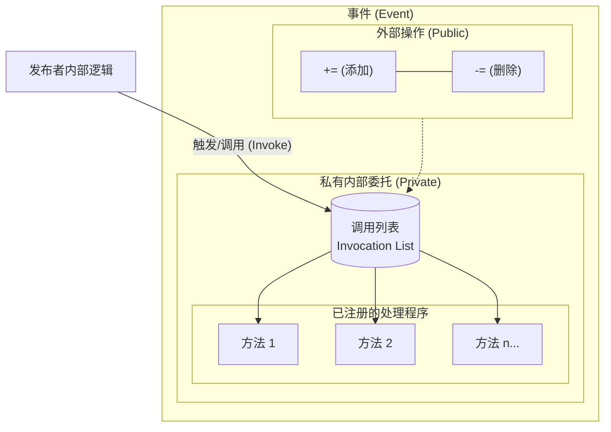

## 1. 发布者和订阅者

当一个特定的程序事件发生时，程序的其他部分可以得到该事件已经发生的通知。

事件的核心角色只有两个：
- **发布者**（publisher）：定义了一系列程序其他部分可能感兴趣的事件。事件发生时，发布者触发事件
- **订阅者**（subscriber）：通过向发布者提供一个方法（回调方法）来"注册"，以获得事件发生的通知

术语：
- publisher / subscriber — 发布者 / 订阅者，可以是类或结构
- event handler — 事件处理程序，订阅者类定义的方法
- raise / fire / invoke — 触发事件

### 事件是专门用于某种特殊用途的委托

事件包含了一个私有的委托。外部只能做两件事：`+=` 添加、`-=` 删除。发布者内部触发事件时，依次调用（Invoke）事件处理程序。



## 2. 事件的 5 个代码组件

1. **委托类型声明** — 事件和事件处理程序必须有共同的签名和返回类型
2. **事件声明** — `public event`，访问修饰词是 public
3. **事件处理程序** — 订阅者定义的响应方法，可以是实例方法、静态方法、匿名方法或 Lambda
4. **事件注册** — 用 `+=` 订阅
5. **触发事件代码** — 发布者类内部 Invoke 的代码

## 3. 声明事件

```csharp
public event EventHandler CountedADozen;
```

- `event` 关键字 + 委托类型 + 事件名
- 可以添加 `static` 关键字声明静态事件
- 可以使用逗号分隔列表声明一个以上的事件
- 事件是类的成员，会被隐式初始化为 `null`

## 4. 订阅事件

使用 `+=` 给事件添加处理程序，本质是**委托的多播（Multicast Delegates）**。

### 4.1 委托是不可变的

每次 `+=` 不会修改原委托，而是创建一个新的多播委托实例，将新旧方法的调用列表合并。`-=` 是移除——同样是创建新实例，只是去掉指定的方法。

```csharp
// += 背后等价于
CountedADozen = (MyDelegate)Delegate.Combine(CountedADozen, handler);
// -= 背后等价于
CountedADozen = (MyDelegate)Delegate.Remove(CountedADozen, handler);
```

**为什么这样设计？**

假设 A 线程正在 `Invoke` 遍历调用列表，B 线程同时 `+=`。如果委托可变，调用列表在遍历中途被修改，A 线程立刻崩溃。不可变设计让 `+=` 生成全新实例，正在执行的 `Invoke` 拿到的还是旧实例，互不干扰。

字符串同理——如果字符串可变，一个线程在读，另一个线程改了它，读到脏数据。此外字符串常用作字典的 key，一旦可变，hash 值就变了，整个字典直接损坏。

| 动作          | 字符串（string）                      | 事件 / 委托（delegate）                                                                   |
| :---------- | :------------------------------- | :---------------------------------------------------------------------------------- |
| 直接赋值 (`=`)  | 变量指向新字符串，原字符串成为垃圾回收对象            | 变量指向新委托，原委托成为垃圾回收对象；<span style="color:red;">事件在类外部禁止直接使用 `=` 赋值，仅支持 `+=` 操作</span> |
| 组合运算 (`+=`) | 不能在原内存空间追加内容，必须重新开辟内存，创建拼接后的新字符串 | 不能在原委托列表直接追加方法，必须重新开辟内存，创建包含新增方法的新多播委托                                              |

### 4.2 事件处理程序的四种形式

事件处理程序必须与事件的委托**签名一致**（相同返回类型 + 参数列表）：

```csharp
// ① 实例方法
var sub = new Subscriber();
publisher.MyEvent += sub.HandleEvent;

// ② 静态方法
publisher.MyEvent += Subscriber.StaticHandleEvent;

// ③ 匿名方法
publisher.MyEvent += delegate(object s, EventArgs e) { Console.WriteLine("触发"); };

// ④ Lambda 表达式
publisher.MyEvent += (s, e) => Console.WriteLine("触发");
```

## 5. 触发事件

触发事件的本质是**调用委托的 Invoke**。只有发布者类内部可以触发事件。

**为什么触发前要检查 null**：如果事件没有任何订阅者，底层委托就是 `null`，直接调用会抛 `NullReferenceException`。

```csharp
// 传统写法
if (CountedADozen != null)
    CountedADozen.Invoke(this, EventArgs.Empty);

// C# 6+ 简洁写法
CountedADozen?.Invoke(this, EventArgs.Empty);
```

**.NET 惯例——用 `OnXxx` 虚方法包装触发逻辑：**

```csharp
// protected virtual → 子类可以 override 在事件前后插入逻辑
protected virtual void OnCountedADozen(EventArgs e)
{
    CountedADozen?.Invoke(this, e);
}
```

好处：
- 触发逻辑集中在一处，方便维护
- `virtual` 允许派生类在事件触发前后加入自定义行为
- 命名以 `On` 开头，符合 .NET 约定

## 6. 完整示例：自定义委托方式

```csharp
using System;

// ① 委托类型声明
public delegate void PriceChangedHandler(decimal oldPrice, decimal newPrice);

// 发布者
class Product
{
    private decimal _price;
    public string Name { get; }

    // ② 事件声明
    public event PriceChangedHandler PriceChanged;

    public Product(string name, decimal price)
    {
        Name = name;
        _price = price;
    }

    public decimal Price
    {
        get => _price;
        set
        {
            if (_price == value) return;
            decimal old = _price;
            _price = value;
            // ⑤ 触发事件
            OnPriceChanged(old, _price);
        }
    }

    protected virtual void OnPriceChanged(decimal oldPrice, decimal newPrice)
    {
        PriceChanged?.Invoke(oldPrice, newPrice);
    }
}

// 订阅者
class PriceMonitor
{
    private readonly decimal _threshold;

    public PriceMonitor(decimal threshold)
    {
        _threshold = threshold;
    }

    // ③ 事件处理程序
    public void OnPriceChanged(decimal oldPrice, decimal newPrice)
    {
        if (newPrice - oldPrice > _threshold)
            Console.WriteLine($"价格大幅上涨：{oldPrice:C} → {newPrice:C}");
    }
}

class Program
{
    static void Main()
    {
        var product = new Product("键盘", 100m);
        var monitor = new PriceMonitor(10m);

        // ④ 事件注册
        product.PriceChanged += monitor.OnPriceChanged;

        product.Price = 105m;  // 涨幅 5，不触发警告
        product.Price = 120m;  // 涨幅 15 > 10，触发警告
        product.Price = 130m;  // 涨幅 10，不触发
    }
}
```

## 7. 标准事件用法：EventHandler\<T\>

.NET 为事件提供了标准模式，目的是让所有事件遵循统一的签名约定。

### 7.1 EventHandler 委托

```csharp
public delegate void EventHandler(object sender, EventArgs e);
```

| 参数 | 类型 | 作用 |
|---|---|---|
| `sender` | `object` | 保存触发事件的对象的引用 |
| `e` | `EventArgs` | 保存与事件相关的状态信息 |

- 返回类型固定为 `void`
- 两个参数都是基类型，对任何事件处理器都通用
- 实际使用时大部分场景直接写 `EventHandler`，不需要自己声明委托类型

### 7.2 通过扩展 EventArgs 来传递数据

`EventArgs` 本身不携带任何数据。需要传递数据时两步走：
1. 声明一个**派生自 EventArgs 的类**来装数据
2. 用 `EventHandler<T>` 替代自定义委托

```csharp
public delegate void EventHandler<TEventArgs>(object sender, TEventArgs e);
```

完整示例：

```csharp
using System;

// ① 自定义 EventArgs —— 携带价格变动数据
public class PriceChangedEventArgs : EventArgs
{
    public decimal OldPrice { get; }
    public decimal NewPrice { get; }

    public PriceChangedEventArgs(decimal oldPrice, decimal newPrice)
    {
        OldPrice = oldPrice;
        NewPrice = newPrice;
    }
}

// ② 发布者 —— 用 EventHandler<T> 替代自定义委托
class Product
{
    private decimal _price;
    public string Name { get; }

    // 一行声明，不需要再写 delegate
    public event EventHandler<PriceChangedEventArgs> PriceChanged;

    public Product(string name, decimal price)
    {
        Name = name;
        _price = price;
    }

    public decimal Price
    {
        get => _price;
        set
        {
            if (_price == value) return;
            decimal old = _price;
            _price = value;
            OnPriceChanged(new PriceChangedEventArgs(old, _price));
        }
    }

    protected virtual void OnPriceChanged(PriceChangedEventArgs e)
    {
        PriceChanged?.Invoke(this, e);
    }
}

// ③ 订阅者 —— 签名与 EventHandler<T> 匹配
class PriceMonitor
{
    public void OnPriceChanged(object sender, PriceChangedEventArgs e)
    {
        Console.WriteLine($"{((Product)sender).Name} 价格变动：{e.OldPrice:C} → {e.NewPrice:C}");
    }
}
```

### 7.3 两种写法的对比

| | 自定义委托 | 标准 EventHandler |
|---|---|---|
| 声明 | `delegate void XxxHandler(...)` + `event XxxHandler` | 只需 `event EventHandler<T>` 一行 |
| 参数 | 自由定义 | 固定 `(object sender, T e)` |
| 适用场景 | 非标准签名、跨程序集的高性能场景 | 绝大多数场景，与 .NET 生态一致 |

## 8. 事件访问器

程序员可以修改 `+=` 和 `-=` 运算符的行为，使用 `add` 和 `remove` 块：

```csharp
private EventHandler _myEvent;
public event EventHandler MyEvent
{
    add    { _myEvent += value; /* 自定义逻辑 */ }
    remove { _myEvent -= value; /* 自定义逻辑 */ }
}
```

## 与 CAD 事件的联系

CAD 开发中的事件遵循同样模式，见 [CAD开发/事件.md](../CAD开发/事件.md)。区别在于 CAD 事件是框架预定义的，你只需要订阅，不需要自己声明。

## 闪卡

事件怎么声明的？从事件的声明可以看出事件的本质是什么？事件触发后做了什么？ ?.是什么？为什么说?.Invoke是线程安全的？
- ==1;;`event` 关键字 + 委托类型 + 事件名，因此事件本事是委托。;;问题1、2==
- ==1;;事件触发后就去调用委托的Invoke函数,执行订阅者注册的方法;;问题3==
- ==1;;空条件运算符==，作用是==1;;先看看左边是不是null，不是再往后调用==。
- ?.Invoke是一个语法糖，会对左边的表达式==1;;进行一次求值，并缓存结果给一个临时变量==，因为==1;;委托的不可变性，这个结果就是不可变的委托引用，保证后续操作的线程安全==。如果不做缓存，事件这个字段指向哪个委托实例是可以随时改变的，在多线程情况下，后续操作可能会指向null，即使之前做了判断。
示例代码
```csharp
//声明事件
public event PropertyChangedEventHandler PropertyChanged;

//触发事件执行的代码
private void OnPropertyChanged([CallerMemberName] string propertyName = null)
{
    if (PropertyChanged != null)//因为事件是类的成员，初始化时为null，所以要判断
        PropertyChanged.Invoke(this, new PropertyChangedEventArgs(propertyName));
    //PropertyChanged?.Invoke(this,new)是线程安全的
}
```
<!--SR:!2026-06-19,15,250-->


为什么委托的不可变性能保证线程安全?
首先，线程是==1;;CPU 调度的基本单位==，线程间可以==1;;共享进程的内存==。因此，线程间可以直接==1;;读写共享变量==。
委托的不可变设计，让每次 += 都能生成全新的实例，假设线程A正在遍历调用列表，线程B同时+=，生成新的委托实例，那么线程B的这个操作==1;;不会影响A遍历==。
（如果委托可变，有点像之前我总是在foreach循环里改变数组的意思）
<!--SR:!2026-06-21,13,230-->