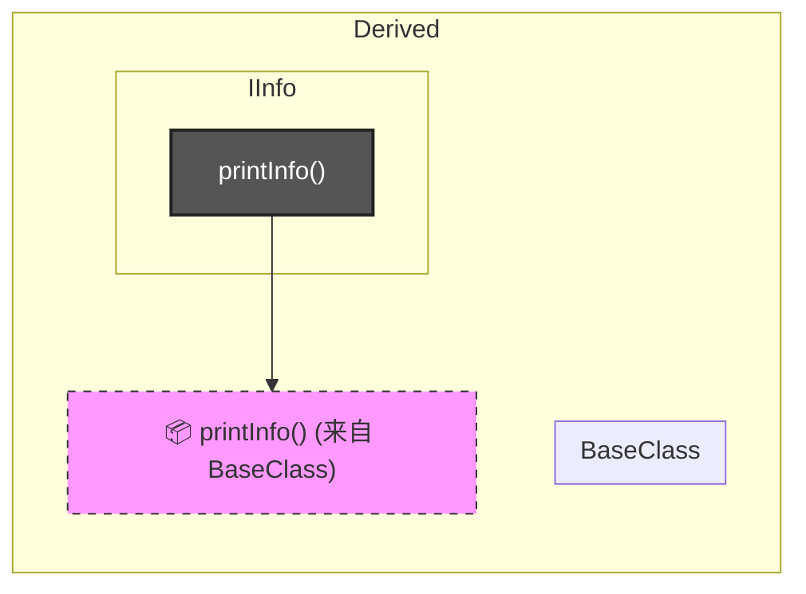
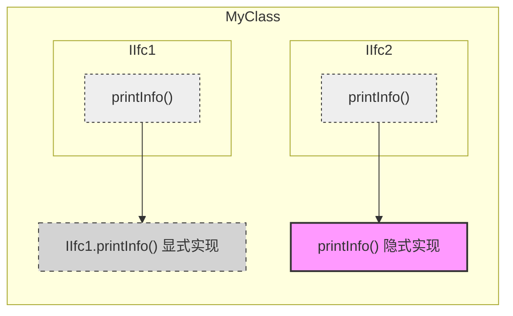

## 1. 接口
### 1.1 接口的一些简单介绍，为什么需要接口

为什么需要接口？接口是规定实现了我这个接口的类必须有什么能力（like-a），比如一个方法，接收一个参数，但是**这个方法不需要关心这个参数的具体类型是什么**，只需要关心传进来的类型是否具有某种能力。

比如下面这个例子。
```csharp
  interface IInfo
    {
        string GetName();
        string GetAge();

    }
    class A :IInfo
    {
        public string Name;
        public int Age;

        public string GetAge()
        {
            return Age.ToString();
        }

        public string GetName()
        {
            return Name;
        }
    }
    class B:IInfo
    {
        public string First;
        public string Last;
        public double PersonsAge;

        public string GetAge()
        {
            return PersonsAge.ToString();
        }

        public string GetName()
        {
            return First + " " + Last;
        }
    }

    class Program
    {
        static void PrintInfo(IInfo item)
        {
            Console.WriteLine("Name:{0},Age:{1}", item.GetName(), item.GetAge());
        }
    }
```

上面的例子可以看出，`PrintInfo` 只依赖 `IInfo` 契约，任何实现了 `IInfo` 的类都可以传入，实现了**多态与解耦**。

### 1.2 接口的基本规则

- 接口成员**默认 `public`**，不能有访问修饰符。
    
- 方法、属性、事件、索引器只能有**声明，不含实现**（C# 8.0 后才允许默认实现，此处基于经典接口）。
    
- 接口不能包含实例字段，只能定义属性（`get`/`set`）。
    
- 实现类必须提供**相同的返回类型、名称和参数列表**的成员，且必须为公开。
    
- 接口是引用类型，可以声明接口变量，但**不能实例化**接口本身，只能指向实现类的实例。
    
- 接口命名惯例以大写 `I` 开头（如 `IComparable`、`IEnumerable`）。
- 静态类不能用接口

### 1.3 IComparable 示例

IComparable接口，里面声明了CompareTo方法
`int CompareTo(object obj);`

>.NET文档里写道，这个方法应该返回负数值、正数值或者零，表示当前对象与参数对象的大小关系。
Array的**静态方法sort**，是使用数组中的每个元素的IComparable实现，对整个一维数组进行排序。

自定义一个类实现IComparable
```csharp
  class MyClass: IComparable
    {
        public int TheValue;

        public int CompareTo(object obj)
        {
            var other = (MyClass)obj;
            if (this.TheValue > other.TheValue) return 1;
            if (this.TheValue < other.TheValue) return -1;
            return 0;
        }
    }
```


### 1.4 多个接口与重复成员

一个类可以实现多个接口。如果多个接口定义了**相同签名**的成员，只需**一个公共实现**即可满足所有接口。

### 1.5 派生成员作为实现

如果基类已经实现了某个接口成员，而这个接口是在它派生类的接口列表里，那么即便派生类不写接口实现，也会自动满足该接口的要求。

黑色框表示接口本身没有实现，实际代码由基类提供。

### 1.6 显式接口成员实现

与单个类实现多个接口需要的成员进行对比，如果想为**每个接口都实现**其所需要的成员，需要使用显式接口实现。

>最典型的就是`List<T>`这类现代容器会同时实现IEnumerable和`IEnumerable<T>`接口，因此会显式实现IEnumerable接口。

```csharp
IEnumerator IEnumerable.GetEnumerator()
{
    return GetEnumerator();
}
```


显式接口实现（接口名称加点分割符，后面跟成员名称，注意不能加访问修饰符）
```csharp
//比如
interface ITest
{
    void Func();
}

class A:ITest
{
	void ITest.Func() //显式接口实现，不可以写访问修饰符
		{
			//实现逻辑
		}
}

```
只有显式接口实现，没有类级别的成员实现也是可以的。因此，实现接口有三种场景

- 只提供类级别的公共实现（隐式实现）；
- 只提供显式接口实现；
- 两者皆有（此时显式实现与公共实现可以共存）。

**调用规则**：

- 显式接口成员**只能通过接口类型的引用来调用**，对类的实例是隐藏的。
- 例如：`A obj = new A(); obj.Func();` 会编译错误，只有 `ITest t = obj; t.Func();` 才能访问。

即对类对象隐藏，对接口变量可见。

显式接口实现与类级别的公共隐式实现对比示意图如下：



### 1.7 接口的继承

在 C# 中，接口之间的“实现”关系在术语和语法上都统一称为**接口继承**（Interface Inheritance）或**扩展**。

>在 C# 中，如果接口 A 继承自接口 B，那么任何实现接口 A 的类，在编译器看来，**必须物理上写出接口 B 的实现代码**。

>特别的，interface A：B 如果接口A使用new关键字（名称屏蔽Name Hiding）屏蔽了接口B的同名方法，那么为了消除歧义需要显示实现接口B的方法。

### 1.8 接口跟泛型的区别

| 对比点  | 接口                   | 泛型                    |
| ---- | -------------------- | --------------------- |
| 核心思想 | 规定能力（能做什么），不关心具体类型   | 延迟指定类型，类型占位符，逻辑已写定    |
| 关注点  | 不关心具体类型是哪个，只关心是否实现契约 | 仍然关心类型，可通过约束限制可用的类型   |

泛型是具体类型先空着，不填，等具体实现的时候再赋予，是一个类型占位符。比如泛型类，这个类里面的定义已经写完了，比如某一方法的**具体实现逻辑已经写完**，只是具体类型是什么没有确定。等使用泛型类、泛型方法、泛型接口时，再把类型参数指定成具体类型。**泛型还是关心这个类型是什么的**，没有约束时，编译器只知道 T 至少是 object，有约束时，比如where T :XXX就 是限制这个T只能是XXX类型及其子类。


## 2. 枚举器和可枚举类型

实现枚举器是为了解耦和统一遍历标准。
如果没有枚举器，外部代码想要读取容器里的元素，就必须知道容器的内部结构（这也是我现在疑惑的点，所以这是故意这么设计的，就是要封装容器的内部结构，不让外部知道）。
所以重点是：
有了枚举器，无论容器怎么变，外部代码都可以用同一种方式去读取数据。

### 2.1 为什么foreach语句可以对数组进行迭代？

1. 数组提供一个**枚举器（enumerator）**对象，该对象知道元素的顺序并能逐项返回。
2. 数组通过实现 `GetEnumerator()` 方法获得枚举器。
3. 实现 `GetEnumerator()` 的类型称为**可枚举类型（enumerable type）**。
4. `foreach` 获取枚举器后，反复读取 `Current` 属性得到**迭代变量**（iteration variable）。该变量是只读的，不能修改元素引用。

### 2.2 IEnumerator

枚举器必须实现 `IEnumerator`（或 `IEnumerator<T>`），它包括三个成员：

- `Current`：只读属性，返回序列中当前位置的元素（`object` 类型）。
- `MoveNext()`：将位置前移一项，返回 `true` 表示新位置有效，`false` 表示已越过末尾。**初始位置在第一项之前，必须首次调用 MoveNext 后才能访问 Current**。
- `Reset()`：重置为初始位置（通常不推荐使用）。

内部跟踪位置的方式自由，可以是索引、引用、拓扑指针等。例如一维数组用索引；AutoCAD .NET API 的 `BrepEdgeCollection` 通过
保存 Brep / 起始 Edge 的引用；
Enumerator 根据这些引用进入底层拓扑结构；
MoveNext 更新当前位置；
Current 返回当前位置对应的 Edge。

#### 2.3 IEnumerator跟索引器的区别

**为什么Point3dCollection有索引器而BrepEdgeCollection没有索引器**：

- `Point3dCollection` 具有索引器，适合随机访问。
- `BrepEdgeCollection` 是一种拓扑遍历视图，更适合按拓扑关系逐步访问，因此只提供枚举器而非索引器。

所以

- **索引器**（`this[int index]`）是一种参数化属性，允许通过 `obj[index]` 或 `obj["key"]` 按位置/键访问单个元素。
- **IEnumerator** 解决的是**顺序遍历整批数据**的问题。

二者是独立的能力：

- 有索引器 ≠ 可以 `foreach`；
- 可以 `foreach` ≠ 有索引器。

### 2.4 IEnumerable

实现 `IEnumerable` 的类就是可枚举类，该接口只有一个方法 `GetEnumerator()`，返回枚举器对象。

- 非泛型 `IEnumerable` 返回 `IEnumerator`（`Current` 是 `object`），需要向下类型转换，不是类型安全的。
    
- 泛型 `IEnumerable<out T>` 返回 `IEnumerator<T>`，并且 `IEnumerator<T>` 继承了 `IEnumerator` ，它用 `new` 关键字屏蔽了非泛型的 `Current`，提供类型安全的 `T Current`。此外，它还继承了IDisposable接口，为了能让非托管类型也能实现枚举器。

### 2.5 泛型枚举接口的协变

`IEnumerator<out T>` 和 `IEnumerable<out T>` 中的 `out` 表示**协变**，即可以把 `IEnumerator<string>` 赋值给 `IEnumerator<object>`（在一定条件下）。这增强了泛型接口的灵活性。

### 2.6 迭代器 iterator

迭代器是一种**用 `yield return` 简化枚举器创建**的语法糖。编译器会自动生成一个实现 `IEnumerator`（或 `IEnumerator<T>`）的内部类，并维护状态机。

yield return 会让编译器帮你生成 IEnumerator。

```csharp
IEnumerator<string> BlackAndWhite()
{
    yield return "black";
}
```

编译后等价于：

```csharp
class BlackAndWhiteEnumerator : IEnumerator<string>
{
    private int state = 0;
    private string current;
    public string Current => current;
    object IEnumerator.Current => Current;
    public bool MoveNext()
    {
        if (state == 0)
        {
            current = "black";
            state = 1;
            return true;
        }
        return false;
    }
    public void Reset() { throw new NotSupportedException(); }
    public void Dispose() { }
}
```

迭代器大幅简化了自定义集合的遍历实现，开发者只需关注“依次返回哪些值”，状态管理与 `IEnumerator` 的细节由编译器处理。

具体演示见
[1. yield return](../数据结构/draft/图-邻接表补充.md#1.%20yield%20return)

### 2.7 `IEnumerable和IEnumerable<T> `的区别

IEnumerable 是老的、非泛型版本
`IEnumerable<T> `是新的、泛型版本
`IEnumerable<T> `继承了 IEnumerable

`IEnumerable`：就像一个装满东西但没贴标签的包裹。需要得手动告诉程序（`Cast<T>`）怎么拆开它。
`IEnumerable<T>`：就像一个透明的储物盒（`List<T>`），一眼就能看到里面是什么类型，LINQ 直接就能上手干活。

>在 .NET 中，**数组（Array）原生实现了 `IEnumerable<T>`**。
## 3. 总结速查

|概念|核心作用|关键点|
|---|---|---|
|接口|定义能力契约，解耦|只能声明，不能实例化，支持显式实现|
|显式接口实现|为同名成员提供区分，隐藏于类实例|只能通过接口引用调用|
|`IComparable`|定义对象的大小比较|`CompareTo` 返回正/负/零，用于排序|
|`IEnumerable`|使对象可被 `foreach` 遍历|提供 GetEnumerator，返回枚举器|
|`IEnumerator`|枚举器，管理遍历状态|`MoveNext` + `Current`，初始位于第一项之前|
|索引器|按索引/键访问元素|`this[int i]`，与遍历能力独立|
|`yield return`|迭代器语法糖，自动生成 `IEnumerator` 实现|代码简洁，编译器维护状态机|


## 闪卡

#csharp-flashcards

在 .NET 中，几乎所有泛型集合（如 `List<T>`）都会同时实现这两个接口：**`IEnumerable<T>`和`IEnumerable`**，主要是为了==1;;分别给现代代码和老代码，基础底层使用。==
首先，在 C# 中，如果接口 A 继承自接口 B，那么任何实现接口 A 的类，在编译器看来，==1;;**必须物理上写出接口 B 的实现代码**==。
因此，虽然`IEnumerable<T>`接口使用new关键字屏蔽了`IEnumerable`的getenumerator方法，为了支持老代码那些只认`IEnumerable`接口的方法，以`List<T>`为例，`List<T>`需要==1;;显示实现`IEnumerable`接口的GetEnumerator函数。==
<!--SR:!2026-09-20,80,250-->

什么是可能多次枚举：==1;;把一个包含数据的“输送带”（延迟加载的查询），重复启动（遍历）了多次，这会导致底层代码被重复执行。==
IEnumerable作为变量存的是什么：==1;;`IEnumerable` 不存数据，里面存的是怎么去遍历集合。==
延迟执行：==1;;写完 `Where`、`Select` 或 `OrderBy` 时，C# 根本还没有去筛选或排序。只有开始执行 `foreach`、`.Count()` 或 `.ToList()` 的那一刻，电脑才会真正开始遍历和计算数据。==
<!--SR:!2026-09-28,55,260-->