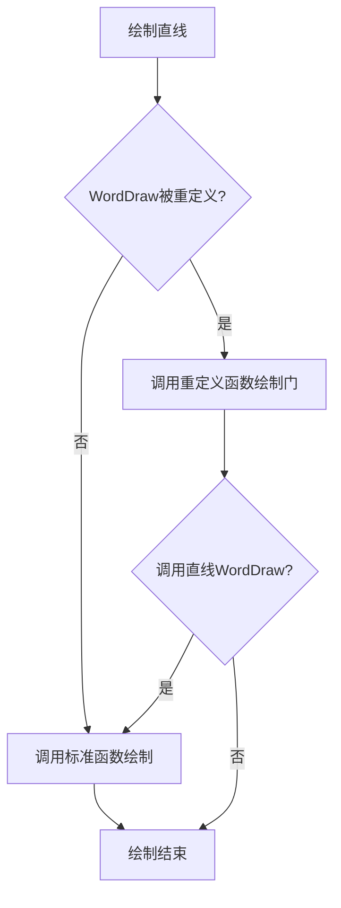
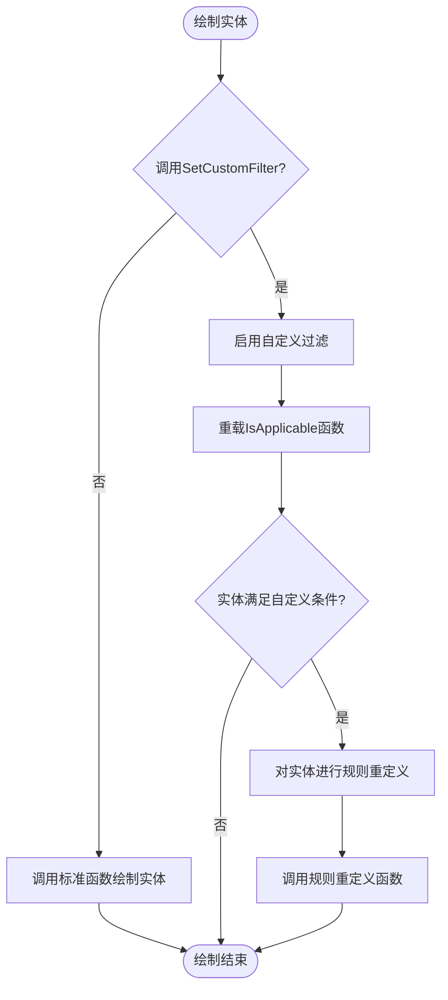

---
date:
tags:
status: draft
---

### Jig 实现

随着鼠标移动，屏幕出现动态预览。

#### 使用 `EntityJig` 类以拖动圆心的方式创建圆

#####  `EntityJig` 类

 `EntityJig` 是EditorInput命名空间下的一个抽象类。里面有两个抽象函数，Sampler和Update。
 为了在创建图形对象时，移动鼠标能出现橡皮筋的拖拽效果，其中一个办法是从EntityJig派生出一个新类，实现两个抽象方法，最后将派生类的实体加入到图形数据库中。

##### 使用步骤

- 实例化一个EntityJig派生类
- 调用Editor的Drag函数，开始拖拽，Drag函数会在并在拖拽过程中依次调用Sampler和Update函数，直到用户结束循环
	- 调用Sampler函数时，程序会检测用户的输入，同时建立提示字符，拖动这些字符将显示在命令行中
	- 调用Update函数时，程序会动态更新要创建的图形对象，从而产生动态的拖拽效果。
- 检测Drag函数的返回状态确定拖动过程中所作的修改，如用户取消或终止拖动，则应该执行适当的清除操作。否则，将派生类实体加入到图形数据库中，完成图形的创建。

##### Sampler函数
Sampler函数中，首先需要进行交互操作，实例化一个形如JigPromptXXXOptions的提示选项类，检测用户的输入，用JigPrompts类（Sampler函数的参数）的形如AcquireXXX的函数，得到用户的输入（PromptXXXResult类）。
比如AcquireAngle函数，提示用户输入一个角度值；AcquireDistance函数，提示用户输入一段距离。

```csharp
  protected override SamplerStatus Sampler(JigPrompts prompts)
  {
       var optJig = new JigPromptPointOptions("...");
       var resJigDis = prompts.AcquirePoint(optJig);
  }
```

SamplerStatus是枚举类，当为OK时表示实施了拖拽，NoChange为拖拽停止，Cancel为拖拽取消。

##### JIG操作

```csharp
for()
{
	var resJig = ed.Drag(circleJig);
}

```

#### 使用 `EntityJig` 类创建等边三角形及其内切圆

使用EntityJig类只能拖拽一个对象，如果

#### 使用 `DrawJig` 类创建有拖拽效果的椭圆

与`EntityJig` 类不同的是，`DrawJig` 类可以拖拽多个对象，适用于具有拖拽效果的编辑操作，复制，移动等。且另一个抽象函数是**WorldDraw**函数而不是Update函数。

1、声明一个`DrawJig` 类的派生类ElRecJig，并为其添加构造函数，声明成员变量
```csharp
public Ellipse m_Ellipse;
private Polyline m_PolyLine;
private Point3d m_Pt1, m_Pt2;

// 派生类的构造函数.
public ElRecJig(Point3d pt1, Ellipse ellipse, Polyline polyline)
{
    m_Pt1 = pt1;
    m_Ellipse = ellipse;
    m_PolyLine = polyline;
}
```

2、补充WorldDraw函数代码
```csharp
protected override bool WorldDraw(WorldDraw draw)
{
    draw.Geometry.Draw(m_Ellipse);
    draw.Geometry.Draw(m_PolyLine);
    return true;
}
```

3、输入Sampler代码，提示用户指定椭圆外切矩形的第二个角点

- 定义点拖拽交互类
- 设置光标类型
- 进行拖拽限制
- 拖拽基点必须是WCS点，如果是从用户交互处拿的点需要进行转换
- AcquirePoint函数获得拖拽得到的即时点


4、输入commandmethod函数，分别初始化矩形和椭圆

- 指定椭圆外切矩形的第一个角点
- 加载线型 dash
- 初始化矩形（多段线初始化，设置closed和linetype属性）和椭圆
- 初始化派生类 点、矩形、椭圆
- 调用ed的Drag函数（返回类型是PromptResult类型），当status为ok时，将椭圆添加进数据库


> 动态计算离输入点最近的曲线点作为jig基点

1. 完全可以把这个最近点设置为 `BasePoint`。
2. `BasePoint` 可以每次 `Sampler()` 动态重新计算。
3. 如果只是为了动态输入中的距离、角度参考，这样做很合适。
4. 如果你希望看到“最近点 → 鼠标”的动态连线，最好在 `WorldDraw()` 中自己绘制，而不要依赖系统 RubberBand，因为系统 RubberBand 对动态变化的基点支持并不理想。


### 规则重定义 overrule

在不创建自定义实体地前提下，动态拦截、修改或接管cad原生实体地默认行为。

#### 显示重定义：改变实体的外观




##### 为类注册规则重定义对象

##### 重载显示重定义的worlddraw函数

#### 重定义有扩展数据的实体

当直线开启显示重定义后，所有的直线都变成了门，这是一个问题。

##### 根据扩展数据有选择地进行规则重定义

##### 

#### 自定义过滤：重定义复合条件地实体




