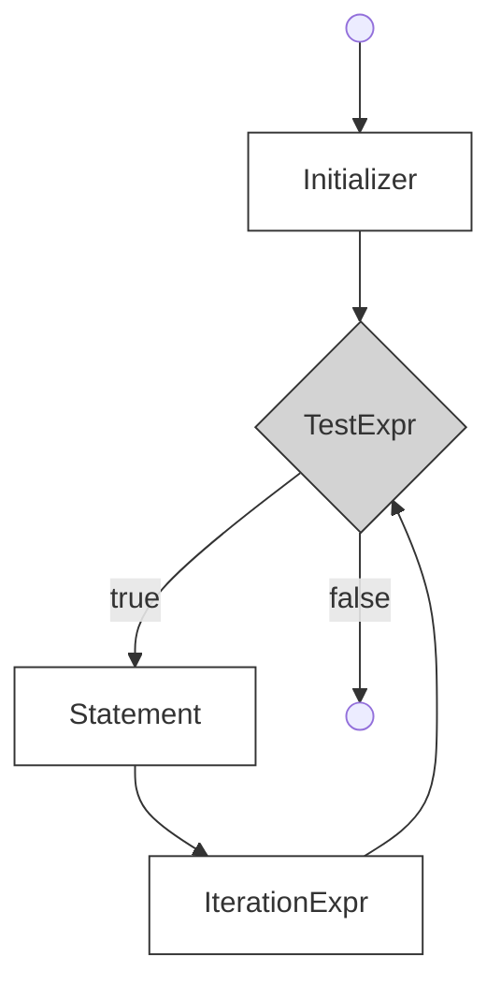

> 从每天零散记录中归集到 C# 的零散知识点。各条目保留原始日期。

---

## 2026.4.18 — 数组、交错数组、协变、浅复制

**一维数组和矩阵**：基类和秩说明符 `[]` 内的逗号表示数组维度（rank），一个逗号就是二维数组。数组长度和维度长度是不同的概念。

**交错数组**：子数组的元素个数可以不同。与一维数组和矩阵不同的是，创建交错数组时堆上有不止一个数组对象——有一个顶层数组和对应的子数组对象。交错数组的独立方括号决定了数组的秩。

**数组协变**：引用类型数组，且赋值的对象类型和数组基类型有隐式或显式转换时支持。（区别于泛型协变，参见 [[../../Csharp/draft/泛型]]）

**clone**：浅复制。

## 2026.4.27 — this 关键字与静态字段

**this 关键字**代表当前类的实例。如果输入命令后 CAD 内部创建了一个类实例，可以在方法里用 this 记录下这个类实例，然后传给自定义类。但不建议直接传整个类实例。

如果一个类已经编译好了，它不可能知道后来才写出来的类名——类名是编译期的事，实例引用是运行期的事。想要交互可以通过接口、委托实现。

## 2026.4.28 — 闭包、相对路径、LINQ、foreach 陷阱

**闭包 = 函数 + 它捕获的外部变量环境**。lambda 可以使用外部局部变量，捕获的是**变量本身**，不是当时的值。

**相对路径**：不是从磁盘根目录开始，而是从"当前文件所在位置"开始找。`..` 表示上一级目录。`.\` 表示当前文件夹，一般可省略。

**LINQ GroupBy → ToDictionary**：
```csharp
curves.GroupBy(curve => curve.Layer).ToList();
// GroupBy返回 IGrouping<TKey, TSource>

curvesGroupByLayerName.ToDictionary(
    g => g.Key, 
    g => g.Sum(curve => curve.GetDistanceAtParameter(curve.EndParam)));
```

**foreach 遍历时不能改集合**——添加或删除都会报错。

**控制小数位数**：`length.ToString("F2")` → "123.46"；`length.ToString("0.0")` → "123.5"

## 2026.4.29 — 协变逆变补充、编译器优化、读懂代码方法（主内容已并入 泛型.md 和 类和继承.md）

**C# 版本**：C# 8.0 是专门针对 .NET Core 的第一个主要 C# 版本。C# 9 随 .NET 5 发布。

**编译器优化**不是指"帮你改源代码"，而是指：编译器在保证程序结果不变的前提下，把你写的代码转换成更高效的机器执行形式。包括：常量折叠、删除未使用代码、内联函数、循环优化、寄存器优化、调整指令顺序。Release 编译器优化更强，Debug 有调试信息。

**怎么读懂不熟悉的代码？拆分着看**：
```csharp
Func<int> MakeCounter()
{
    int count = 0;
    return () => { count++; return count; };
}
```
① 返回类型是 `Func<int>` ② 有一个被 lambda 捕获的局部变量 count ③ 返回一个无参数、返回 int 的 lambda

**委托的定义**十分短，只关心能保存什么形状的方法。`delegate TResult Func<out TResult>();` 中：delegate 是委托关键字，尖括号是类型参数列表，in 修饰输入参数类型，out 修饰返回值类型，圆括号是形参列表。

## 2026.5.4 — 反射与 NETLOAD（主内容已并入 反射和特性.md）

NETLOAD 后发生了啥？
1. 把 DLL 加载进 AutoCAD 进程
2. 启动/使用 .NET CLR 运行环境
3. 读取 DLL 里的类型和方法
4. 找到带 `[CommandMethod]` 的方法
5. 把命令名和方法建立映射关系
6. 输入命令后，如果是实例方法就创建类实例，否则直接执行静态方法

事件是回调的一种常见形式。AutoCAD 命令方法也是回调的一种形式。区别只是：事件靠 `+=` 注册，AutoCAD 命令靠 `[CommandMethod]` 注册。`CommandMethod` 特性，C# 只负责把这个特性信息编译进 DLL，真正干活的是 AutoCAD。

---

## 2026.6~9 — 语言细节归集

### 格式化与转换

**`ToString("G")` 通用格式**：自动判断——整数（如 5.0）去掉小数点输出 `"5"`，小数（如 5.25）保留小数，无穷大/NaN 直接输出 `"Infinity"` / `"NaN"`。

**`ToString("F2")`** 固定小数位数 → `"123.46"`；`ToString("0.0")` → `"123.5"`，小数位由格式串里 `0` 的个数决定。

>[!warning] `F` 是"固定小数位"，不是"有效数字"
>之前记成「`ToString("f")` 保留两位有效数字」，这是两回事：
>- `F` = Fixed-point，`ToString("F2")` 是**保留 2 位小数**（`1234.5678` → `"1234.57"`）。
>- **有效数字**是另一套概念（`1234.5678` 保留 2 位有效数字 → `"1200"`）。
>- C# 里没有直接对应"有效数字位数"的标准格式串，要自己算或配合 `Math.Round` 换算数量级。

**解析数字用 `TryParse`，别用正则**：

```csharp
return double.TryParse(num, out _);
```

正则写"这串字符是不是合法数字"又长又难读，改起来还容易漏。`TryParse` 一句话表达同样的意思，而且失败不抛异常。

>[!warning] `Math.Round` 不完全等于四舍五入
>默认用的是**银行家舍入**（四舍六入五取偶）——遇到 `.5` 往偶数那边靠，不是总往大靠。要真正的四舍五入得指定 `MidpointRounding.AwayFromZero`。
>
>

### switch

**`when` 条件过滤**——把"类型匹配"和"值判断"合成一步：

```csharp
switch (curve1)
{
    case Arc arc1 when curve2 is Arc arc2:
        break;
    case Line line1 when curve2 is Line line2:
        break;
}
```

**标签穿透（fall-through）**指的是多个 case 标签共用同一段执行体。这是我们自己确认两个标签"该做同一件事"，不是漏写 break。C# 限定：只有标签内没有其他代码时才能穿透。

**`char` 是数值类型**，`'0'` 的值是 48。

### 值类型 vs 引用类型

**传参和返回最能体现区别**：值类型不管作为实参传入，还是作为返回值，总是复制一份——不管这个值原本在栈上还是堆上。引用类型传的、返回的都是指向实例的内存地址。

**引用类型的属性赋值**：两个引用指向同一个对象时，改一个就相当于改了另一个。但如果属性里是值类型，改那个字段不会影响另一个对象，因为值类型赋值时复制了一份过去。

>[!warning] getter 有副作用时，别在判断条件里反复读
>每次访问属性 getter 都会执行一次 get 方法。如果 getter 里做了计算：
>
>```csharp
>public double Value => CalculateValue();
>```
>
>那么 `if (value > 5 && value < 10)` 每次比较都会重算，值可能中途变化，读代码的人会被绕进去。
>
>```csharp
>value = obj.Value;   // 先缓存，再拿缓存去判断
>```

**struct 什么时候用**：不需要继承、不需要实现接口、体积不大的时候。反过来，**不能声明静态结构体**——静态类强调全局唯一、不创建实例，而值类型的存在意义就是"可以复制着传"，两者语义冲突；允许静态结构体在设计上也是冗余的。

**通过属性拿到的 struct 不能改成员**：getter 返回的是副本，改副本没有意义，编译器直接拦截。

```csharp
class A
{
    public MyStruct Test { get { return new MyStruct(); } }
}

var a = new A();
a.Test.Name = "x";   // 编译不通过：Test 是 getter 复制出来的副本
```

只有直接拿到字段才能改。

### 异常

**`throw ex` 会清空并重置调用栈**，把出错点错误地标记在 `throw ex` 这一行，原始堆栈就丢了。要保留原始堆栈用 `throw;`。

**`TryXxx` 有"默认不抛异常"的心理作用**——调用方看到 Try 前缀就知道失败是正常路径，不用 try/catch 包起来。

### 惰性求值

**`Func<>` 是有返回值的委托**，最后一个类型参数是返回值（`out` 修饰）；`Action<>` 是没有返回值的委托。

**工厂函数（Factory Function）**：专门用来创建并返回新对象的函数，把创建细节封装在函数内部。

**`Lazy<T>`** 做延迟初始化——把对象的创建推迟到第一次真正使用的时候，而不是声明变量时就创建。默认用加锁实现线程安全：线程 A 创建时线程 B 排队等待，创建完成后 B 直接拿到同一个对象，保证全局只创建一次。

```csharp
private readonly Lazy<DrawingInfo> _info = new Lazy<DrawingInfo>(() => Compute());
```

`Lazy` 的构造函数要传一个工厂方法进来，而这个工厂方法只有返回值、没有参数。如果真正干活的方法需要传参，就在外面"套"一层只有返回值的 lambda。

**惰性求值有链式触发**：如果属性 A 的计算依赖属性 B，而 A、B 都访问频率低、计算量大，就两个都 lazy——真正访问 A 时才连带把 B 也算出来。

>[!example] 典型用例
>零件图的包围盒是派生数据，用到时再算就行，适合 lazy。

**字段初始化放哪**：就算字段是惰性初始化的，只要它在初始化时要用到实例的某个属性/字段，就必须把初始化挪进构造函数。只有依赖静态（与实例无关）成员时，才可以直接在字段上初始化。

**C# 常见的惰性求值场景**：

| 场景 | 例子 |
| --- | --- |
| LINQ | `Where()`、`Select()` |
| 迭代器 | `yield return` |
| Lazy | `Lazy<T>` |
| 数据流 | Stream |
| ORM | Entity Framework 查询 |

### 自动只读属性

`public double Value { get; }` 编译器会自动生成一个隐藏字段，只是省略了 `get` 里 `return` 的那个字段。本质上构造函数给这个字段赋值，属性返回它。

如果手写这个字段，通常要加 `readonly`——`readonly` 对引用类型限制的是"不能重新赋值为别的引用"，引用指向的对象内部数据还是能改。用自动只读属性，字段被省掉了，连改的机会都没有。

### 显式实现接口

显式实现的接口成员不会出现在 public 成员列表里，只能通过接口访问。

**代价**：会造成对值类型不必要的装箱拆箱——接口引用不能直接存 struct，把实现了接口的 struct 赋给接口引用会装箱。

**什么时候用**：只有当接口成员不应该成为类的公开 API 时才用。

### 单例设计模式

保证一个类只有一个实例，且易于被访问。三个要点：只能有一个实例、自行创建这个实例、向整个系统提供这个实例。单例是一种对象创建模式。

拥有一个私有构造函数（用户无法 `new`），加上一个静态私有成员变量和一个静态公有的工厂方法。工厂方法负责检验实例是否存在、不存在就实例化并存入静态成员变量。

```csharp
private static HelpManager _instance;   // 自身的静态私有成员变量
public static HelpManager Instance      // 公有的访问入口，检验实例存在性
{
    get
    {
        if (null == _instance)
        {
            _instance = new HelpManager();
        }

        return _instance;
    }
}
```

**优点**：可以严格控制客户怎样以及何时访问它。系统内存中只有一个对象，对需要频繁创建销毁的对象能节约资源；也允许基于单例模式扩展出"指定个数的实例"。

**缺点**：单例类职责过重——既提供工厂方法又提供业务方法，一定程度上违背单一职责原则。而且没有抽象层，难以扩展（C# 里抽象类不允许实例化）。

> 提防"外部多次创建实例"的写法混进来——单例成立的前提是唯一实例只从 `Instance` 走。

---

## 闪卡

#csharp-flashcards

readonly对引用类型，限制==1;;重新赋值==，但是==1;;可以对内部数据进行修改==。在类中设置引用类型为readonly，可以防止以后写代码时不小心把这个变量==1;;重新赋值为其他引用==。
<!--SR:!2026-11-16,83,270-->

通过属性拿到的（getter）的struct实例，不能直接修改该实例的成员，为什么？
?
因为通过属性拿到的struct实例，这个实例是副本
get{return xxx}
因此修改副本的成员没有意义。
比如
```CSHARP
Struct MyStruct
{
	public double a{get{return 10;}}
}

class A
{
	public MyStruct test{get{return new MyStruct()}}
}

var temp = new A();
A.test.a = 5;//编译器不通过
```
test是通过getter复制出来的，再去修改副本的属性没有意义。
除非直接拿的字段。
<!--SR:!2026-09-24,22,250-->

递增运算符和递减运算符，不管是 `++`、`--` 前置还是后置，语句执行之后操作数本身的值是相同的。把 `x++` 赋给变量 y，y 拿到的是 x 的旧值；`++x` 赋给 y，y 拿到的是加 1 后的新值。`x += 1` 赋值时也是新值，而且更灵活，不只是递增 1。

`??` 空合并运算符

```csharp
public string MyProperty
{
    get
    {
        if (a != null) { return a; }
        else { return b; }
    }
}
```

等价于 `MyProperty => a ?? b;` —— a 不是 null 返回 a，是 null 返回 b。

值类型和引用类型，在函数传入、返回这一块最能体现区别：值类型不管是作为实参传入函数，还是作为函数返回值，总是复制一份（不管这个值类型在哪里，栈或堆上）；引用类型总是把内存地址传入，或者返回一个指向引用类型实例的内存地址。

> [!question] 如果值类型作为集合的元素，那么它在堆上，是不是很难找到值类型实例在堆上的具体位置？

`TryGet` 有一个默认不抛异常的心理作用。

为什么不能声明为静态结构体？
- 设计冗余
- 值类型冲突：值类型可以通过复制传值，而静态类强调全局唯一性、不应该创建实例

> `SelectMany` 的展开见 [[../../Csharp/LinQ#SelectMany：扁平化]]

`epsilon` 一般代表极小的正数、误差或特定参数；数学上指"任意小的正数"。

#补充-flashcards

A/B = Q...R
取余（remainder）和取模（modulo）有什么区别？为什么不同语言 `%` 的结果可能不一样？
- **余数（remainder）**：结果的符号 ==1;;跟随被除数==。C# / C / Java 的 `%` 是余数。
- **模（modulo）**：结果的符号 ==1;;跟随除数==。Python 的 `%` 和数学上的 `mod` 是模。
举例（-7 和 3）：
- 被除数 -7，除数 3 → 余数 = ==1;;-1==，模 = ==1;;2==
造成这两种计算差异的原因是取整方式的不同。
Q有两种取整方式
- 取余采用==1;;向零取整，即直接抹去计算结果小数点后面的数字，向零靠拢。比如1.25会变成1，-1.25会变成-1==
- 取模采用==1;;向下取整，取不大于这个商的最大整数，-1.25会变成-2==
<!--SR:!2026-09-17,23,230-->

怎么获得二维数组某个维度的数量::二维数组提供了GetLength函数，输入参数为维度。
<!--SR:!2026-10-05,81,270-->

---

## 收件箱归集

- [2026.5.13] 空指针异常 `NullReferenceException`：访问值为 null 的引用类型变量的成员时抛出。可用 null 条件运算符 `?.` 避免。事件常用 `?.Invoke`——触发前必须检查是否为 null
- PE 文件结构、JIT 编译、IL 代码的关系：
  - **PE** = Portable Executable，Windows 上 .exe/.dll 的文件格式
  - **IL** = Intermediate Language，C# 源码先编译成与 CPU 无关的中间语言
  - **JIT** = Just-In-Time，运行时用到哪段 IL 就当场翻译成机器码
  - 串起来：C# 源码 → 编译 → IL（存进 dll/exe，按 PE 格式打包）→ JIT → 机器码 → CPU 执行
  - .NET 的 dll 能被反编译（IL 保留大量元数据），C++ 的 dll 不行（编译出来是原生机器码）。CAD 的 `acdbmgd.dll` 是 managed 包装层，底层 ObjectARX 还是 C++ 原生 dll
- 并发 vs 并行、进程 vs 线程的对照表已并入 [[../../计算机/系统与硬件#并发与并行|系统与硬件 → CSAPP]]
- 一个进程至少有一个线程（主线程）。多线程共享堆内存，所以有并发安全问题——这也是委托设计为不可变的原因之一
- 异常捕获：输入阶段的错误用弹窗，计算时的异常自己处理/反馈用户
- **if-else 原则**：范围越小越具体的条件写前面，越大越模糊的写后面
- **变化点对照规律**：

| isCurrent | isForward | 取端点 | 切向 |
| --- | --- | --- | --- |
| true | true | EndPoint | +1 |
| true | false | StartPoint | -1 |
| false | true | StartPoint | -1 |
| false | false | EndPoint | +1 |

`isCurrent == isForward` 时取终点且切向为正，不等时取起点且切向为负

- **Curve3d 与 Curve 不同步问题**：同一条曲线延伸两次时，第一次 `curve3d.SetInterval` 后旧对象已拉长，但第二次用到的新端点来自新 DB 曲线——两个来源的 interval 不一致 → 延伸量算错。延伸后要重取 `curve3d = curve.GetGeCurve()` 保持同步
- **写完代码三步**：① 跑通 → 回头看一眼 → 精简 ② 把两个分支并排，圈出不一样的地方（端点、符号）③ 画个 2×2 真值表，找规律 → 抽成变量 → 删掉重复分支
- 深克隆链表/数组：LinkedList 构造函数接受 `IEnumerable<T>`，用 LINQ 对每个元素做 Clone 后传入。List 用 `ToList()`。List 和 LinkedList 均不支持泛型协变
- for 循环语句：

```csharp
for(Initializer; TestExpr; IterationExpr)
```



三个表达式都是可选的。如果中间 TestExpr 为空，假定返回 true，必须用其他方式退出循环避免死循环。初始化和迭代表达式可包含多个表达式，用逗号隔开

- [2026.6] Visual Studio 调试器在展开集合时，默认不会显示对象完整结构，而是调用 `ToString()` 作为摘要提示。所以给集合元素类重写 `ToString()` 会直接影响调试时的可读性
- [2026.6] 框架文档里不写默认值（比如集合的初始容量），往往是因为"最优初始容量"属于**实现细节**，会随框架版本变化。也就是说，不应该写依赖某个具体默认值的代码
- [2026.7] 特性（Attribute）的参数必须在**编译时**就是常量
- [2026.7] 变量职责不单一、留着不用的分支、注释怎么写——三条已并入 [[../../计算机/编码理论#代码阅读时容易放过的地方|编码理论]]
- [2026.7] **解构交换**：用**解构赋值**实现两个变量值对调，不借助临时变量：`(a, b) = (b, a);`。传统写法必须借一个 Temp，这是"解构语法"和"变量交换"两件事的结合
