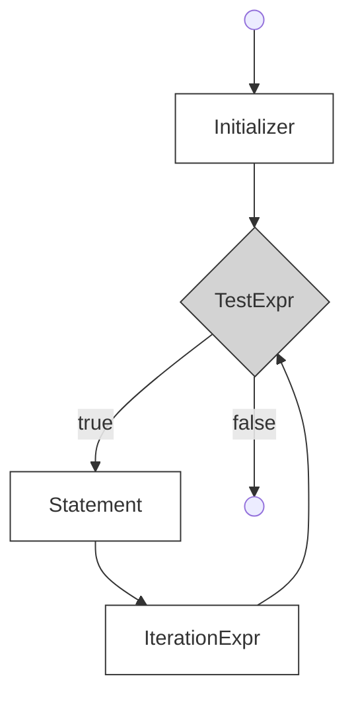

> 从每天零散记录中归集到 C# 的零散知识点。各条目保留原始日期。

---

## 2026.4.18 — 数组、交错数组、协变、浅复制

**一维数组和矩阵**：基类和秩说明符 `[]` 内的逗号表示数组维度（rank），一个逗号就是二维数组。数组长度和维度长度是不同的概念。

**交错数组**：子数组的元素个数可以不同。与一维数组和矩阵不同的是，创建交错数组时堆上有不止一个数组对象——有一个顶层数组和对应的子数组对象。交错数组的独立方括号决定了数组的秩。

**数组协变**：引用类型数组，且赋值的对象类型和数组基类型有隐式或显式转换时支持。（区别于泛型协变，参见 [[../../Csharp/draft/泛型]]）

**clone**：浅复制。

## 2026.4.27 — this 关键字与静态字段

**this 关键字**代表当前类的实例。如果输入命令后 CAD 内部创建了一个类实例，可以在方法里用 this 记录下这个类实例，然后传给自定义类。但不建议直接传整个类实例。

如果一个类已经编译好了，它不可能知道后来才写出来的类名——类名是编译期的事，实例引用是运行期的事。想要交互可以通过接口、委托实现。

## 2026.4.28 — 闭包、相对路径、LINQ、foreach 陷阱

**闭包 = 函数 + 它捕获的外部变量环境**。lambda 可以使用外部局部变量，捕获的是**变量本身**，不是当时的值。

**相对路径**：不是从磁盘根目录开始，而是从"当前文件所在位置"开始找。`..` 表示上一级目录。`.\` 表示当前文件夹，一般可省略。

**LINQ GroupBy → ToDictionary**：
```csharp
curves.GroupBy(curve => curve.Layer).ToList();
// GroupBy返回 IGrouping<TKey, TSource>

curvesGroupByLayerName.ToDictionary(
    g => g.Key, 
    g => g.Sum(curve => curve.GetDistanceAtParameter(curve.EndParam)));
```

**foreach 遍历时不能改集合**——添加或删除都会报错。

**控制小数位数**：`length.ToString("F2")` → "123.46"；`length.ToString("0.0")` → "123.5"

## 2026.4.29 — 协变逆变补充、编译器优化、读懂代码方法（主内容已并入 泛型.md 和 类和继承.md）

**C# 版本**：C# 8.0 是专门针对 .NET Core 的第一个主要 C# 版本。C# 9 随 .NET 5 发布。

**编译器优化**不是指"帮你改源代码"，而是指：编译器在保证程序结果不变的前提下，把你写的代码转换成更高效的机器执行形式。包括：常量折叠、删除未使用代码、内联函数、循环优化、寄存器优化、调整指令顺序。Release 编译器优化更强，Debug 有调试信息。

**怎么读懂不熟悉的代码？拆分着看**：
```csharp
Func<int> MakeCounter()
{
    int count = 0;
    return () => { count++; return count; };
}
```
① 返回类型是 `Func<int>` ② 有一个被 lambda 捕获的局部变量 count ③ 返回一个无参数、返回 int 的 lambda

**委托的定义**十分短，只关心能保存什么形状的方法。`delegate TResult Func<out TResult>();` 中：delegate 是委托关键字，尖括号是类型参数列表，in 修饰输入参数类型，out 修饰返回值类型，圆括号是形参列表。

## 2026.5.4 — 反射与 NETLOAD（主内容已并入 反射和特性.md）

NETLOAD 后发生了啥？
1. 把 DLL 加载进 AutoCAD 进程
2. 启动/使用 .NET CLR 运行环境
3. 读取 DLL 里的类型和方法
4. 找到带 `[CommandMethod]` 的方法
5. 把命令名和方法建立映射关系
6. 输入命令后，如果是实例方法就创建类实例，否则直接执行静态方法

事件是回调的一种常见形式。AutoCAD 命令方法也是回调的一种形式。区别只是：事件靠 `+=` 注册，AutoCAD 命令靠 `[CommandMethod]` 注册。`CommandMethod` 特性，C# 只负责把这个特性信息编译进 DLL，真正干活的是 AutoCAD。

---

## 闪卡

#补充-flashcards

A/B = Q...R
取余（remainder）和取模（modulo）有什么区别？为什么不同语言 `%` 的结果可能不一样？
- **余数（remainder）**：结果的符号 ==1;;跟随被除数==。C# / C / Java 的 `%` 是余数。
- **模（modulo）**：结果的符号 ==1;;跟随除数==。Python 的 `%` 和数学上的 `mod` 是模。
举例（-7 和 3）：
- 被除数 -7，除数 3 → 余数 = ==1;;-1==，模 = ==1;;2==
造成这两种计算差异的原因是取整方式的不同。
Q有两种取整方式
- 取余采用==1;;向零取整，即直接抹去计算结果小数点后面的数字，向零靠拢。比如1.25会变成1，-1.25会变成-1==
- 取模采用==1;;向下取整，取不大于这个商的最大整数，-1.25会变成-2==
<!--SR:!2026-09-17,23,230-->

怎么获得二维数组某个维度的数量::二维数组提供了GetLength函数，输入参数为维度。
<!--SR:!2026-10-05,81,270-->

---

## 收件箱归集

- [2026.5.13] 空指针异常 `NullReferenceException`：访问值为 null 的引用类型变量的成员时抛出。可用 null 条件运算符 `?.` 避免。事件常用 `?.Invoke`——触发前必须检查是否为 null
- PE 文件结构、JIT 编译、IL 代码的关系：
  - **PE** = Portable Executable，Windows 上 .exe/.dll 的文件格式
  - **IL** = Intermediate Language，C# 源码先编译成与 CPU 无关的中间语言
  - **JIT** = Just-In-Time，运行时用到哪段 IL 就当场翻译成机器码
  - 串起来：C# 源码 → 编译 → IL（存进 dll/exe，按 PE 格式打包）→ JIT → 机器码 → CPU 执行
  - .NET 的 dll 能被反编译（IL 保留大量元数据），C++ 的 dll 不行（编译出来是原生机器码）。CAD 的 `acdbmgd.dll` 是 managed 包装层，底层 ObjectARX 还是 C++ 原生 dll
- 并发 (Concurrency) vs 并行 (Parallelism)：

| | 并发 | 并行 |
| --- | --- | --- |
| 关注点 | 任务调度、响应速度 | 计算吞吐、性能 |
| 执行方式 | 时间片轮转，交替执行 | 多核同时执行 |
| 硬件要求 | 单核即可 | 必须多核 |
| 比喻 | 一个人同时下三盘棋 | 三个人分别下三盘棋 |

- 线程与进程：

| | 进程 | 线程 |
| --- | --- | --- |
| 概念 | 操作系统分配资源的基本单位 | CPU 调度的基本单位 |
| 资源 | 独立内存空间 | 共享所属进程的内存 |
| 开销 | 创建/切换开销大 | 创建/切换开销小（轻量级） |
| 通信 | 需 IPC（管道、Socket 等） | 直接读写共享变量 |
| 独立性 | 一个进程崩溃不影响其他 | 一个线程崩溃通常导致整个进程挂掉 |

- 一个进程至少有一个线程（主线程）。多线程共享堆内存，所以有并发安全问题——这也是委托设计为不可变的原因之一
- 异常捕获：输入阶段的错误用弹窗，计算时的异常自己处理/反馈用户
- **if-else 原则**：范围越小越具体的条件写前面，越大越模糊的写后面
- **变化点对照规律**：

| isCurrent | isForward | 取端点 | 切向 |
| --- | --- | --- | --- |
| true | true | EndPoint | +1 |
| true | false | StartPoint | -1 |
| false | true | StartPoint | -1 |
| false | false | EndPoint | +1 |

`isCurrent == isForward` 时取终点且切向为正，不等时取起点且切向为负

- **Curve3d 与 Curve 不同步问题**：同一条曲线延伸两次时，第一次 `curve3d.SetInterval` 后旧对象已拉长，但第二次用到的新端点来自新 DB 曲线——两个来源的 interval 不一致 → 延伸量算错。延伸后要重取 `curve3d = curve.GetGeCurve()` 保持同步
- **写完代码三步**：① 跑通 → 回头看一眼 → 精简 ② 把两个分支并排，圈出不一样的地方（端点、符号）③ 画个 2×2 真值表，找规律 → 抽成变量 → 删掉重复分支
- 深克隆链表/数组：LinkedList 构造函数接受 `IEnumerable<T>`，用 LINQ 对每个元素做 Clone 后传入。List 用 `ToList()`。List 和 LinkedList 均不支持泛型协变
- for 循环语句：

```csharp
for(Initializer; TestExpr; IterationExpr)
```



三个表达式都是可选的。如果中间 TestExpr 为空，假定返回 true，必须用其他方式退出循环避免死循环。初始化和迭代表达式可包含多个表达式，用逗号隔开
