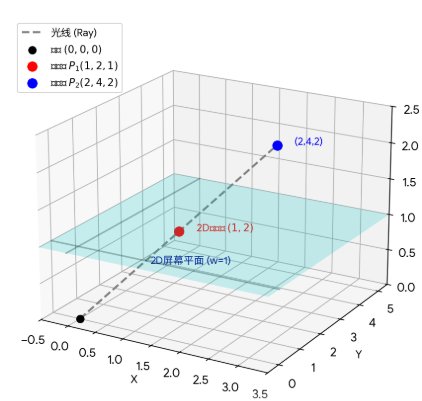

# 矩阵

矩阵在数学上是线性方程组的紧凑写法，在 CAD 中是**空间变换**的工具。这两条线最终汇合：矩阵乘法就是变换的组合。

## 1. 矩阵作为空间变换

点/向量以**列向量** $\vec{P}$ 表示，变换矩阵左乘：

$$
P' = M \cdot P
$$

### 1.1 为什么需要齐次坐标？

平移是向量加法：$(x, y) \to (x + t_x,\; y + t_y)$。但 2×2 矩阵只能表示线性变换（旋转、缩放），塞不进加法项。

解决方案：**升一个维度**，用矩阵的最后一列实现加法。

齐次坐标 $(x, y, w)$ 对应实际坐标 $(x/w,\; y/w,\; 1)$。



> 

### 1.2 三大基本变换（2D 齐次坐标）

| 变换类型 | 矩阵形式 | 说明 |
|----------|---------|------|
| **平移** | $\begin{bmatrix}1 & 0 & t_x \\ 0 & 1 & t_y \\ 0 & 0 & 1\end{bmatrix}$ | 最后一列控制位移量 |
| **旋转** | $\begin{bmatrix}\cos\theta & -\sin\theta & 0 \\ \sin\theta & \cos\theta & 0 \\ 0 & 0 & 1\end{bmatrix}$ | 绕原点逆时针旋转 $\theta$ |
| **缩放** | $\begin{bmatrix}s_x & 0 & 0 \\ 0 & s_y & 0 \\ 0 & 0 & 1\end{bmatrix}$ | 对角线控制各轴缩放比 |

### 1.3 扩展到 3D

3D 变换用 4×4 齐次矩阵，逻辑完全一致：平移在最后一列（前三行），旋转在左上 3×3 子矩阵。

---

## 2. 矩阵乘法与组合变换

### 2.1 乘法规则

$M_1 \cdot M_2$ 的含义：先用 $M_2$ 变换，再用 $M_1$ 变换。**越靠近 $\vec{P}$ 的矩阵越先执行**：

$$
P' = M_1 \cdot M_2 \cdot P
$$

$M_2$ 紧贴 $P$，最先起作用。

> [!WARNING] 不满足交换律
> $M_1 \cdot M_2 \neq M_2 \cdot M_1$。先旋转后平移 ≠ 先平移后旋转（想想 CAD 中的体验）。

### 2.2 类比：函数复合

矩阵乘法就像函数复合 $f(g(x))$——$g$ 先执行，$f$ 后执行。列向量体系下，右边的矩阵 = 内层函数，先作用于向量。

---

## 3. 行列式的几何意义

行列式 $|M|$ 表示变换后**有向面积/体积的缩放因子**：

| $|M|$ 的值 | 含义 |
|-----------|------|
| $= 1$ | 保面积/体积（纯旋转、平移） |
| $> 1$ | 面积/体积放大 |
| $0 < \|M\| < 1$ | 面积/体积缩小 |
| $= 0$ | 变换降维（如把平面压成一条线），矩阵不可逆 |
| $< 0$ | 翻转方向（镜像），坐标系从右手系变为左手系 |

> 平移矩阵的行列式始终为 1——平移不改变面积/体积。

---

## 4. CAD 中的矩阵运算

### 4.1 Matrix3d 静态方法

```csharp
// 平移矩阵
Matrix3d trans = Matrix3d.Displacement(vector);

// 旋转矩阵 —— 绕经过中心点、方向为指定向量的轴旋转
Matrix3d rotation = Matrix3d.Rotation(angle, axis, center);
```

### 4.2 矩阵乘法运算符

```csharp
public static Matrix3d operator *(Matrix3d a, Matrix3d b);
// 返回 a * b
```

### 4.3 Entity.TransformBy

```csharp
Point3d TransformBy(Matrix3d leftSide);
// P' = leftSide * P
```

### 4.4 PreMultiplyBy 与 PostMultiplyBy

Matrix3d 提供两个方法来控制乘法顺序：

| 方法 | 等价操作 | 新变换的执行时机 |
|------|---------|----------------|
| `PostMultiplyBy(m)` | `this = this * m` | $m$ 在右边，贴近 $P$ → **先**执行 |
| `PreMultiplyBy(m)` | `this = m * this` | $m$ 在左边，远离 $P$ → **后**执行 |

```csharp
Matrix3d mat = Matrix3d.Displacement(vector);  // mat = 平移

// PostMultiplyBy：mat = 平移 * 旋转 → 先旋转，再平移
mat.PostMultiplyBy(rotation);

// PreMultiplyBy：mat = 旋转 * 平移 → 先平移，再旋转
mat.PreMultiplyBy(rotation);
```

> "Pre/Post" 描述的是 $m$ 在乘法表达式中的**位置**（左/右），不是执行先后。列向量体系下，**右边贴近向量，先执行**。

---

## 5. 正交基的构建

在 CAD 中常需要从一个法向量出发，构建完整的局部坐标系（三个互相垂直的单位向量）。

### 5.1 从单个向量构建正交基

已知单位向量 $\vec{n}$（法线方向），求两个互相垂直的切向量 $\vec{t}$、$\vec{b}$：

```csharp
void BuildOrthonormalBasis(Vector3d n, out Vector3d t, out Vector3d b)
{
    // 选一个不平行于 n 的参考向量
    Vector3d reference = (Math.Abs(n.Z) < 0.9)
        ? new Vector3d(0, 0, 1)   // n 不接近 Z 轴 → 用 Z 轴做参考
        : new Vector3d(0, 1, 0);  // n 接近 Z 轴 → 换 Y 轴做参考

    t = n.CrossProduct(reference).GetNormal();  // t ⊥ n, t ⊥ reference
    b = n.CrossProduct(t);                       // b ⊥ n, b ⊥ t，已是单位向量
}
```

**步骤**：参考向量 × $\vec{n}$ → $\vec{t}$ → $\vec{n}$ × $\vec{t}$ → $\vec{b}$。两次叉积构造右手正交系。

### 5.2 已知法向量求垂直向量

给定法向量 `inVector`，求垂直于它的任意单位向量：

```csharp
private Vector3d GetNormalByInVector(Vector3d inVector)
{
    double tol = 1.0E-7;
    if (Abs(inVector.X) < tol && Abs(inVector.Y) < tol)
    {
        // inVector 平行于 Z 轴 → 直接返回 X 方向的垂直向量
        if (inVector.Z >= 0) return new Vector3d(-1, 0, 0);
        else return Vector3d.XAxis;
    }
    else
    {
        // 取 XY 分量，绕 Z 轴转 90° 到水平垂直方向
        var yAxis2d = new Vector2d(inVector.X, inVector.Y);
        yAxis2d = yAxis2d.RotateBy(PI * 0.5);
        var yAxis = new Vector3d(yAxis2d.X, yAxis2d.Y, 0);
        // 再以 inVector 为轴转 90° 得到最终垂直向量
        var normal = yAxis;
        normal = normal.RotateBy(PI * 0.5, inVector);
        return normal;
    }
}
```

---

## 闪卡

> [!NOTE]- 齐次坐标解决的核心问题是什么？
> 2×2 矩阵只能表示线性变换（旋转/缩放），塞不进平移的加法项。升维到 3×3 齐次矩阵，用最后一列实现平移。

> [!NOTE]- 矩阵乘法中，哪个矩阵先作用于向量？
> 列向量体系下：$M_1 \cdot M_2 \cdot P$，$M_2$ 在右边、紧贴 $P$，**先**执行。

> [!NOTE]- PreMultiplyBy 和 PostMultiplyBy 的区别？
> - `PostMultiplyBy(m)`：`this = this * m`，$m$ 贴近向量 → 先执行
> - `PreMultiplyBy(m)`：`this = m * this`，$m$ 远离向量 → 后执行

> [!NOTE]- 行列式 = 0 意味着什么？
> 变换把空间降维了（如 2D 中把平面压成一条线），矩阵不可逆，信息丢失。Column picture 中意味着列向量线性相关。
