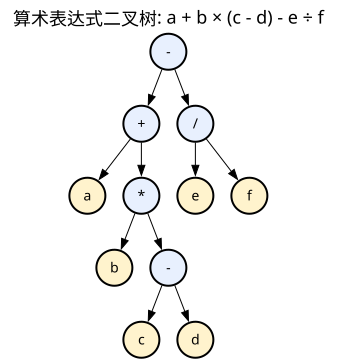
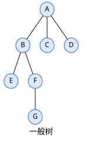

## 引入

树是**层次结构**——一对多，所以是非线性结构。从递归的角度看，一棵树 = 根结点 + m 棵互不相交的子树。

![[dot/树结构.svg]]

> [!important] 关键
> 线性结构（数组、链表）是一对一，树是一对多，图是多对多。树 = 没有环的连通图。


>**森林**：m (m≥0) 棵互不相交的树的集合。给森林加一个根，就变成了树。

默认讨论的是有序树。

---

## 基础概念

树是基于结点的数据结构，每个结点可以含有多个链，分别指向其他多个结点（1:N）。

### 术语表

| 术语              | 含义                      |
| --------------- | ----------------------- |
| 双亲 (Parent)     | 一个结点的直接前驱               |
| 孩子 (Child)      | 一个结点的直接后继               |
| 兄弟 (Sibling)    | 同一双亲的孩子互称兄弟             |
| 祖先 (Ancestor)   | 从根到该结点路径上的所有结点          |
| 子孙 (Descendant) | 以该结点为根的子树中所有结点          |
| 度 (Degree)      | 结点拥有的孩子数；树的度 = 各结点度的最大值 |
| 叶子 (Leaf)       | 度为 0 的结点                |
| 深度 (Depth)      | 从根到该结点的路径长度             |
| 高度 (Height)     | 从该结点到最深叶子的路径长度          |

> [!NOTE] 深度 vs 高度
> 深度是从根往下数（根深度=0），高度是从叶子往上数（叶高度=0）。
> 所以对于结点来说，深度和高度不是一个概念，对树来说是一样的

### m叉树

> [!NOTE]- $m$ 叉树 vs 度为 $m$ 的树
> 
> | 维度 | 度为 $m$ 的树 (Tree of degree $m$) | $m$ 叉树 ($m$-ary Tree) |
> | :--- | :--- | :--- |
> | **结点度数** | **最大**度数必须等于 $m$（至少有一个节点有 $m$ 个孩子） | 每个结点的度**至多**为 $m$（可以所有节点度都小于 $m$） |
> | **是否允许空**| 不允许，这颗树里必须至少有一个结点，有m个孩子 | 允许（空 $m$ 叉树合法） |

在只有一个子树（或某几个子树空缺）时，空出来的那个位置，到底算不算一个占位符。
从下面的数学定义可以看出，假设去掉根结点后，整棵树只剩下一个叶子结点D，在数学定义里，这个D只属于左子树或者右子树，不管属于那一颗子树，另一颗子树都是空集。

---

### 树的性质

> [!important] 性质 1：结点数 = 边数 + 1
> 每个结点（除根外）恰好有一条边来自双亲。根没有入边。所以总边数 = 结点数 - 1 = 所有结点度数之和。

> [!help]- 性质 2：m 叉树第 i 层最多有几个结点？
> m^(i-1) 个。第 1 层 m⁰ = 1（根），每下一层乘 m。
> 用归纳法证明，i=1时，成立，假设对所有的j，1<= j < i,命题成立，根据树的特性容易证明当 j = i 时，最大结点数量为j-1层的2倍，命题成立。

> [!help]- 性质 3：高度为 h 的 m 叉树最多有几个结点？
> (m^h - 1) / (m - 1)。等比数列求和（首项 1，公比 m，项数 h），错位相减法推出。
>
> m=1 时退化为线性表，m>1 时才有树的层次意义。

> [!help]- 性质 4：高度为 h 的 m 叉树最少有几个结点？
> h 个。每层只有一个结点（每层只分一个孩子）。

> [!help]- 性质 5：n 个结点的 m 叉树的最小/最大高度？
> 最小高度（每层尽量满）：h_min = ⌈log_m(n(m-1) + 1)⌉
> 最大高度（每层一个）：h_max = n

---

## 二叉树 Binary Tree


> [!help]- 什么是二叉树
> 二叉树是结点的有限集合，每个结点最多两个子结点——左子结点和右子结点。
> 注意区分**左孩子**和**右孩子**是不同的，即使一个为空。
> 递归定义：这个有限集合或者是空的，或者由一个根结点加上两颗互不相交的称为左子树和右子树的二叉树组成。

二叉树的五种形态：空二叉树、只有根节点、根和左子树、根和右子树，根和左右子树。

### 完全二叉树

两个条件缺一不可：

> [!important]
> 1. **最后一层之前的每一层都是满的**
> 2. **最后一层的结点严格靠左对齐**

![[dot/完全vs非完全.svg]]

> [!important]- 完全二叉树的意义
> - 可以用**连续数组**存储，结点之间没有空隙。结点 i 的左孩子 = 2i+1，右孩子 = 2i+2，双亲 = (i-1)/2。
> - 如果连续数组第一个格子留空，则结点i的左孩子的数组下边为2i，右孩子为2i+1，双亲 i/2向下取整

### 满二叉树 vs 完全二叉树

![[dot/满二叉树vs完全二叉树.svg|424]]

满二叉树：每一层都达到最大结点数。高度为 h 时有 2^h - 1 个结点，这个结点数量也是二叉树的最大结点数。
满二叉树的顺序表，是对满二叉树从根开始，自上而下，从左到右进行编号。

> [!QUESTION]- 完全二叉树和满二叉树的关系？
> - 满二叉树一定是完全二叉树，完全二叉树不一定是满二叉树。
> - 如果按照自上而下，从左到右的规则进行编号，完全二叉树的结点编号跟满二叉树的结点编号一一对应。

> [!help]- 性质 3：对任何一棵二叉树T，如果其叶结点为$n_0$，度为2的结点数位$n_2$，则有
> $$n_0 = n_2 + 1$$
> 推导：
> 结点数量n，度为1的结点数量为$n_1$，那么
> $$n = n_0 + n_1 + n_2 $$---式子1
> 分支数 B +1 = n (树的性质)
> 边由度为1或2的结点引出，所以
>  B = $n_1 + 2n_2$
>  于是得到
> $$n = 1 + n_1 + 2n_2 $$---式子2

> [!help]- 性质 4：具有n个结点的完全二叉树的深度为？
> $$1+lbn$$

### 二叉树的 ADT

**1. 数据对象 (Data Object)**

$$D = \{ a_i \mid a_i \in \text{元素集合},\; i=1,2,\cdots,n,\; n \geq 0 \}$$

**2. 数据关系 (Data Relationship)**

若 $D = \emptyset$，则 $R = \emptyset$，称 BTree 为空二叉树。
若 $D \neq \emptyset$，则 $R = \{H\}$，$H$ 是如下二元关系：
- 在 $D$ 中存在唯一的称为根的数据元素 root，它在关系 $H$ 下无前驱。
- 若 $D - \{\text{root}\} \neq \emptyset$，则存在 $D - \{\text{root}\} = \{D_l, D_r\}$，且 $D_l \cap D_r = \emptyset$。
- 若 $D_l \neq \emptyset$，则 $D_{l}$ 中存在唯一的元素 $x_{l}$，$\langle\text{root},x_l\rangle \in H$，且存在 $D_{l}$ 上的关系 $H_l \subset H$；
- 若 $D_r \neq \emptyset$，则 $D_{r}$ 中存在唯一的元素 $x_{r}$，$\langle\text{root},x_r\rangle \in H$，且存在 $D_{r}$ 上的关系 $H_r \subset H$；
- $H = \{\langle\text{root},x_l\rangle, \langle\text{root},x_r\rangle, H_l, H_r\}$。
- $(D_l, \{H_l\})$ 是一棵符合本定义的二叉树，称为根的**左子树**；$(D_r, \{H_r\})$ 是一棵符合本定义的二叉树，称为根的**右子树**。

**3. 基本操作 (Basic Operations)**

| 函数声明                        | 功能描述                                        |
| :-------------------------- | :------------------------------------------ |
| `creat()`                   | 创建一个空二叉树。                                   |
| `destroy()`                 | 撤销/销毁一个二叉树。                                 |
| `isempty()`                 | 若二叉树为空，则返回 1；否则返回 0。                        |
| `clear()`                   | 移去所有结点，成为空二叉树。                              |
| `root(x)`                   | 若二叉树非空，则 x 为根的值，并返回 1；否则返回 0。               |
| `maketree(x, left, right)`  | 构造一棵二叉树，根的值为 x，以 left 和 right 分别为左、右子树。     |
| `breaktree(x, left, right)` | 拆分二叉树为三部分，x 为根的值，以 left 和 right 分别为原树的左右子树。 |
| `preorder(visit)`           | 使用函数 visit() 访问结点，先根遍历二叉树。                  |
| `inorder(visit)`            | 使用函数 visit() 访问结点，中根遍历二叉树。                  |
| `postorder(visit)`          | 使用函数 visit() 访问结点，后根遍历二叉树。                  |

>[!note] 
>obsidian默认行内数学分隔符是$ ，不认\( 
>obsidian默认加载的是基础LaTex命令

---

## 三种遍历顺序

递归处理二叉树时，每到一个结点永远有三件事：左子树、当前结点、右子树。**顺序不同，用途不同。**

![[dot/遍历.svg]]

| 遍历             | 顺序     | 结果          |
| -------------- | ------ | ----------- |
| 前序 (Preorder)  | 根→左→右  | A B D E C F |
| 中序 (Inorder)   | 左→根→右  | D B E A F C |
| 后序 (Postorder) | 左→右→根  | D E B F C A |
| 层序 (Level)     | 逐层从左到右 | A B C D E F |

> [!info] 口诀
> 根左右、左根右、左右根。

> [!example] 递归骨架
> ```
> Preorder(node):
>     if node == null: return
>     visit(node)
>     Preorder(node.left)
>     Preorder(node.right)
> ```
> 中序和后序只是 visit 的位置不同。


> [!NOTE] 层序遍历
> 用队列：根入队 → 出队访问 → 左孩子入队 → 右孩子入队 → 循环。

执行二叉树遍历时，若使用**系统递归**，利用系统调用栈即可自动暂存节点，但树退化为链表时易引发**栈溢出（StackOverflowException）**。

若改用**自定义非递归栈**，其容量在最坏情况下为 n。由于二叉树只有向下指向左右孩子的单向指针，无法直接返回双亲，因此在从根节点深入左子树前，必须将根节点指针**压入自定义栈中暂存**，以便后续回溯访问右子树。


>[!tip] 
>- 一棵确定的二叉树，其四种遍历序列是唯一的
>- 但反之，单凭任何一种遍历序列，都无法唯一确定一棵二叉树。
>- 对于算数表达式，由于其特殊的规则，可根据表达式唯一确定一棵二叉树

### 算数表达式


>[!NOTE]
>表达式的先根遍历、中根遍历和后根遍历分别为
>$$-+a*b-cd/ef$$
>$$a+b*(c-d)-e/f$$
>$$abcd-*+ef/-$$

以上三个序列为表达式的前缀（波兰式）、中缀（符合人类习惯的）和后缀标识（逆波兰式）

>[!question]- 如何从中缀表达式唯一确定表达式二叉树？
>- 找到表达式中最后计算的运算符作为根结点，将表达式分为两半。左子树用同样的方法。
>- 如何找到最后计算的运算符，则是根据左结合型、运算符优先级和括号最高优先级这三条规则决定
>如上例，最右边的减号是根结点，减号坐标的表达式，依据同样的规则，最左边的加号是最后计算的运算符，那么就作为左子树的根结点。

>[!question]- 如何从后缀表达式唯一确定表达式二叉树？
>使用一个栈，简单描述就是从前往后把后缀表达式放进栈里，遇到操作符就把它作为根，弹出栈顶的两个操作数，先入栈的放左边，将这个子树压入栈顶，依次遍历完整个后缀表达式。


---

## 根据遍历结果反推树结构

> [!important] 核心原则
> - 前序/后序/层序 → 确定**根结点**
> - 中序 → 划分**左右子树**
> - 必须 **中序 + 另一种遍历** 才能唯一确定二叉树

### 前序 + 中序

```
前序: A B D E C F
中序: D B E A F C
```

1. 前序第一个 = 根 **A**
2. 中序找到 A → 左边 DBE = 左子树，右边 FC = 右子树
3. 左子树前序 BDE、中序 DBE → 根 **B**，左 D，右 E
4. 右子树前序 CF、中序 FC → 根 **C**，左 F，无右
5. 递归直到全部分配

![[dot/遍历.svg]]

### 后序 + 中序

后序最后一个 = 根。其余逻辑相同。

### 层序 + 中序

层序第一个 = 根。中序分左右后，层序中**靠前**的结点是子树的根。

> [!warning] 前序 + 后序不能唯一确定
> 无法区分左右子树边界——形状不同但前序和后序相同的两棵树是存在的。

### 从前序+中序构造的递归算法：

> [!example]
> ```
> BuildTree(preorder, inorder):
>     if preorder 为空: return null
>     root = preorder[0]
>     在 inorder 中找到 root 的位置 k
>     root.left  = BuildTree(preorder[1..k], inorder[0..k-1])
>     root.right = BuildTree(preorder[k+1..], inorder[k+1..])
>     return root
> ```

---

## 二叉树存储

**顺序存储**：把一般二叉树"当作"完全二叉树，空结点也占位。

![[dot/顺序存储.svg]]
```
数组: [0,A, B, C, -, D, -, -]
索引:    1  2  3  4  5  6  7
结点i → 左2i, 右2i+1, 双亲i/2
```

> [!warning] 空间浪费
> 满树用满 2^h-1 个位置，斜树只用了 h 个——其余全空。

**链式存储（二叉链表）**：
`lchild | data | rchild`。
n 个结点 → n+1 个空指针。

>[!NOTE] 推导：
>n个结点有2n个指针，除了根结点，其他结点都会被指针记录，因此，空指针数量为 2n-（n-1） = n+1个空指针

三叉链表多加 `parent`。
`lchild | data | parent | rchild`。
对于查找结点x的双亲，三叉链表很容易实现。

## 一般树的表示


### 双亲表示法

用数组表示一般树

```
下标:   0   1   2   3   4   5   6
结点:   A   B   C   D   E   F   G
双亲:  -1   0   0   0   1   1   5
```

> [!info]
> 找双亲 O(1)，找孩子需遍历 O(n)。

利用每个结点只有唯一双亲的性质（除根）。
找根节点需要进行反复求双亲的操作。

### 孩子表示法

数组 + 链表：每个结点拉一条孩子链表。找孩子快，找双亲需遍历。加 parent 域 → **双亲+孩子表示法**。

```
下标    数据   孩子链表头指针

| 1 |  | A |  | o |-> [child:2|o]-> [child:3|o]-> [child:4|^]
|---|  |---|  |---|
| 2 |  | B |  | o |-> [child:5|o]-> [child:6|^]
|---|  |---|  |---|
| 3 |  | C |  | ^ |
|---|  |---|  |---|
| 4 |  | D |  | ^ |
|---|  |---|  |---|
| 5 |  | E |  | ^ |
|---|  |---|  |---|
| 6 |  | F |  | o |-> [child:7|^]
|---|  |---|  |---|
| 7 |  | G |  | ^ |
'---'  '---'  '---'
```

### 孩子兄弟表示法

用二叉链表存一般树：
`firstchild | data | nextsibling`。
左指针 = 第一个孩子，右指针 = 下一个兄弟。

```
[ ^ | A | ^ ]

    |
    | fc
    ▼
[ fc| B | o ] ──────> [ ^ | C | o ] ──────> [ ^ | D | ^ ]

    |                     |                     |
    | fc                  | fc                  | fc
    ▼                     ▼                     ▼
[ ^ | E | o ]               ^                     ^

    |
    | ns
    ▼
[ fc| F | ^ ]

    |
    | fc
    ▼
[ ^ | G | ^ ]

```

![[dot/孩子兄弟.svg]]
>[!warning] 注意之前提的m叉树和度数为m的树的区别 
>``` 
>     A           A
>    / \         / \
>   B   C       B   C
>  /             \
> D               D
>孩子兄弟表示法
>     A           A
>    /           /
>   B           B
>  / \         / \
> D   C       D   C
>```
>对于上述两个不同的二叉树，使用孩子兄弟法表达的结果是一样的。


---

## 树、森林与二叉树的转换

> [!help]- 树 → 二叉树
> 由于二叉树和树都可用二叉链表作为存储结构，因此以二叉链表作为媒介可导出树与二叉树之间的一个对应关系。
> 给定一棵树，可以找到唯一的一棵二叉树与之对应。

> [!help]- 森林 → 二叉树
> 每棵树先转二叉树，第一棵作总根，后续树的根依次挂在**右孩子**上。

> [!help]- 二叉树 → 森林
> 根的右链拆开（每段一树），每树内部左=孩子、右=兄弟。

---

## 线索二叉树

二叉树中有大量空指针——n 个结点共 2n 个指针域，只有 n-1 条边，剩下 **n+1 个空指针**。

> [!help]- 什么是线索化
> 把空指针利用起来，指向该结点在某种遍历下的**前驱**或**后继**。ltag/rtag 标志区分是"孩子"还是"线索"。

```
中序线索化结果（中序: D B E A C）：

   ltag lchild   data   rchild rtag
   ─────────────────────────────────
    1    null      D       B      1   (D无前驱，后继B)
    0     D        B       E      0   (B有左右孩子)
    1     B        E       A      1   (E前驱B，后继A)
    0     E        A       C      0   (A有左右孩子)
    1     A        C      null    1   (C前驱A，无后继)
```

---

## 二叉搜索树 Binary Search Tree

> [!help]- 什么是 BST
> - 左子树所有结点值 **严格小于** 根结点值
> - 右子树所有结点值 **严格大于** 根结点值
> - 每一棵子树也须满足左小右大

> [!INFO]
> 中序遍历 BST 得到从小到大排序的序列。每次查找可以排除一半子树，效率 O(log n)。

### 退化问题

普通 BST 插入时没有任何平衡检查。按 1, 2, 3 顺序插入：

![[dot/BST退化.svg]]

> [!warning]- BST 的弱点
> BST 的性能完全依赖树的形状。最好 O(log n)，最坏 O(n)。解决方案 → 自平衡树。

### 查找

```
BST-Search(node, key):
    if node == null: return null
    if key == node.val: return node
    if key < node.val: return BST-Search(node.left, key)
    if key > node.val: return BST-Search(node.right, key)
```

### 插入

```
BST-Insert(node, key):
    if node == null: return new Node(key)
    if key < node.val: node.left = BST-Insert(node.left, key)
    if key > node.val: node.right = BST-Insert(node.right, key)
    return node
```

### 删除（三种情况）

1. **叶子**：直接删
2. **只有一个孩子**：用孩子替上来
3. **有两个孩子**：找后继（右子树最左下），用后继值替换，再删后继


> [!help]- 删除逻辑
> 1. 被删结点有**两个**子结点 → 找后继（右子树最左下），用后继值替换，再删除后继
> 2. 被删结点只有**一个**或无子结点 → 直接用子结点（或 null）替换


**性能**：平衡二叉树查找 O(log n)。完全二叉树平均查找步数 ≈ 树高 - 1（错位相减法推导）。

---

## 自平衡树

> [!important] 为什么要自平衡
> BST 不检查形状，最坏退化成链表。自平衡树在每次插入/删除后自动调整，保证 O(log n)。

### AVL 树

每个结点记录**平衡因子** = 左子树高度 - 右子树高度。若 |平衡因子| > 1，旋转恢复。

**四种失衡与旋转：**

| 类型 | 操作 | 场景 |
|------|------|------|
| LL（左子树的左子树） | **右旋** | 插入在左孩子的左侧 |
| RR（右子树的右子树） | **左旋** | 插入在右孩子的右侧 |
| LR（左子树的右子树） | 先左旋左孩子，再右旋 | 插入在左孩子的右侧 |
| RL（右子树的左子树） | 先右旋右孩子，再左旋 | 插入在右孩子的左侧 |

**LL 型——右旋：**

![[dot/AVL右旋.svg]]

> [!NOTE] 右旋本质
> Z 的左孩子 Y 上提为根，Y 的右子树 T3 挂给 Z 当左子树，Z 变成 Y 的右孩子。RR 左旋是对称操作。

### 红黑树（简述）

不追求绝对平衡，用颜色规则保证**最长路径 ≤ 2×最短路径**。

> [!help]- 四条规则
> 1. 每个结点红或黑
> 2. 根是黑色
> 3. 红色结点的孩子必须是黑色（不能连续红）
> 4. 从任一结点到叶子的每条路径黑色结点数相同

---


## 哈夫曼树和哈夫曼编码

### 问题背景

等长编码浪费空间——出现频率高的字符和出现频率低的用同样的位数。

### 前缀问题

```
A: 0    B: 1    C: 10    D: 11
→ B(1) 是 C(10) 的前缀！解码时遇到 "10" 分不清是 B+A 还是 C
```

等长编码可以避免前缀问题，但哈夫曼用变长编码，通过**所有字符都在叶子**保证无前缀歧义。

### 哈夫曼编码

解决两个问题：避免前缀和等长编码浪费空间

哈夫曼编码的目标是让 **树的带权路径长度 (WPL)** 达到最小。算法把"长编码"的代价分配给"极少出现的字符"，把"短编码"的福利留给"经常出现的字符"。

$$WPL = \sum_{i=1}^{n} w_i \times l_i$$

> [!TIP]- 可以理解为
> 出现次数 $\times$ 编码长度的总和（总比特数/位数）达到了绝对的数学最小。

### 构造哈夫曼树

1. 将每个字符视为一棵单结点树，权值 = 出现频率
2. 从森林中选**权值最小的两棵树**合并为新树（新树权值 = 两子树权值之和）
3. 重复直到只剩一棵树
4. 左分支标 0，右分支标 1，从根到叶子的路径 = 该字符的哈夫曼编码

> [!NOTE] 从构造哈夫曼树中，可以看出
> 
> - 频率越低（权值越小） $\rightarrow$ 最早被合并 $\rightarrow$ 层次越深（离根越远） $\rightarrow$ 路径越长 $\rightarrow$ 二进制编码越长。
> - 频率越高（权值越大） $\rightarrow$ 最晚被合并 $\rightarrow$ 层次越浅（离根越近） $\rightarrow$ 路径越短 $\rightarrow$ 二进制编码越短。

> [!NOTE]- 哈夫曼树的用途
> 哈夫曼树用于**无损数据压缩**，是一种可变字长前缀编码算法。

---

## 并查集

>[!NOTE] 使用HashSet判断两个元素是否属于同一集合
>使用HashSet的Contains函数判断当前这个集合是否同时包含这两个元素；
>遍历所有的集合（<span style="color:red;">这些集合是不相交的</span>），看是否有一个集合同时包含这两个元素。
>可以看出，HashSet无法快速判断两个元素是否在同一个集合里。

> [!help]- 什么是并查集 Union Find
> - 一种处理**不相交集合**(Disjoint Sets）的合并与查询的数据结构。
> - 核心操作：Find(x) 找代表，Union(x,y) 合并集合，`is_connected(x, y)`：判断元素 x 和 y 是否属于同一个集合。

>[!NOTE] 数据结构的三要素
逻辑结构、存储结构、所需要的操作

### 并查集的存储结构 

并查集常见的两种实现方式分别侧重于不同操作的效率：
- 一种是「快速查询」——基于数组结构
- 一种是「快速合并」——基于森林结构

#### 快速查询

使用一个数组来表示每个元素所属的集合。
如果，数组的下标代表元素本身，数组的值表示该元素所在集合的编号
如{0},{1,2,3},{4},{5,6},{7}
上述**不相交**集合的数组存储结构如下：


##### 实现步骤

- **初始化**：将每个元素的集合编号设为其自身的下标，即每个元素自成一个集合。
- **合并操作**：将一个集合中的所有元素的 id修改为另一个集合的 id，从而实现集合的合并。这样，合并后同一集合内所有元素的 id 都相同。
- **查找操作**：直接比较两个元素的 id是否相同，如果相同则属于同一集合，否则属于不同集合。
##### csharp实现

```csharp
class UnionFind<T>
{
    private T[] elements;                               // 所有元素
    private Dictionary<T, int> groupId;                 // 元素 → 集合编号（代表元素的下标）

    /// <summary>
    /// 初始化：每个元素自成一个集合，集合编号 = 自身下标
    /// </summary>
    public UnionFind(T[] set)
    {
        elements = set;
        groupId = new Dictionary<T, int>();
        for (int i = 0; i < set.Length; i++)
        {
            groupId.Add(set[i], i);
        }
    }

    /// <summary>
    /// 查找元素 x 所属集合的代表元素
    /// </summary>
    public T Find(T x)
    {
        int id = groupId[x];
        return elements[id];
    }

    /// <summary>
    /// 合并包含 x 和 y 的两个不相交集合
    /// </summary>
    public bool Union(T x, T y)
    {
        int xGroup = groupId[x];   // x 的集合编号
        int yGroup = groupId[y];   // y 的集合编号

        // 已经在同一个集合中，合并失败
        if (xGroup == yGroup)
            return false;

        // 遍历所有元素，将属于 y 集合的元素全部改为 x 的集合编号
        for (int i = 0; i < elements.Length; i++)
        {
            if (groupId[elements[i]] == yGroup)
                groupId[elements[i]] = xGroup;
        }
        return true;
    }

    /// <summary>
    /// 判断 x 和 y 是否在同一个集合中
    /// </summary>
    public bool IsConnected(T x, T y)
    {
        return groupId[x] == groupId[y];
    }
}
```

#### 快速合并

>[!warning] 快速查询的缺点
>可以看到 快速查询 的实现方式中，合并操作效率较低，需要遍历所有的元素，依次将元素进行改指针操作。


为此，可以采用「森林结构」来实现并查集。具体做法是：
用若干棵树（即森林）来表示所有集合，每棵树代表一个集合，树中的每个节点对应一个元素，树的根节点即为该集合的代表元素。

>**注意**：与常规树结构（父节点指向子节点）不同，基于森林的并查集中，<span style="color:red;">每个节点都指向其父节点。</span>

这种实现，逻辑结构是森林，存储结构还是数组
##### 实现步骤

假设有集合{0},{1},{2},{3},{4},{5}
用一个数组A维护森林结构，$A[x]$表示元素x的父节点编号。

- **初始化**：令 $A[x]$=x，即每个元素自成一个集合，自己是自己的根节点。
- **合并操作**：将两个集合的根节点相连，例如令 $A[x]$=y，即把 x 所在集合合并到y所在集合。
- **查找操作**：从某个元素出发，沿着数组不断查找其父节点，直到找到根节点。如果两个元素的根节点相同，则它们属于同一集合，否则属于不同集合。

可以看出，合并操作是一步，查询稍慢
如果不断地把{0}合并到{1},然后把{1}合并到{2}，依次类推，最后8个元素合并到一个大集合中，那么这条查询链会特别长。如下表和图

| 下标索引  | 0   | 1   | 2   | 3   | 4   | 5   |
| :---- | :-- | :-- | :-- | --- | --- | --- |
| 父节点编号 | 1   | 2   | 3   | 4   | 5   | 5   |


为了提升效率，避免上述情况，常用手段为路径压缩

> [!important] 路径压缩 Path Compression 两种实现方式
> 
> ### 1. 隔代压缩 (Halving)
> - **核心概念**：在查找操作时，每次将当前节点直接连接到其父节点的父节点（即跳过一层），通过不断重复这一过程，有效降低树的高度。
> - **结构图示**：
> 
> ```python
> def find(self, x):
>     """
>     查找元素 x 所在集合的根节点（带隔代路径压缩）
>     :param x: 待查找的元素
>     :return: x 所在集合的根节点编号
>     """
>     while self.fa[x] != x:
>         # 将 x 的父节点直接指向其祖父节点，实现隔代压缩
>         self.fa[x] = self.fa[self.fa[x]]
>         x = self.fa[x]  # 继续向上查找
>     return x  # 返回根节点编号
> ```
> 
> ---
> 
> ### 2. 完全压缩 (Full Compression)
> - **核心概念**：在 Find(x) 时，通过递归把路径上经过的所有结点直接挂在最顶层的根节点下面。
> - **结构图示**：![[dot/路径压缩.svg]]
> - **时间复杂度**：平摊复杂度O(α(n))，α 是反阿克曼函数，实际中 \(< 5\)。
> 
> ```python
> def find(self, x):
>     """
>     查找元素 x 所在集合的根节点（带完全路径压缩）
>     :param x: 待查找的元素
>     :return: x 所在集合的根节点编号
>     """
>     if self.fa[x] != x:                             # 如果 x 不是根节点，递归查找其父节点
>         self.fa[x] = self.find(self.fa[x])          # 路径压缩：将 x 直接连接到根节点
>     return self.fa[x]                               # 返回根节点编号
> ```


## 表达式树 —— 把中缀表达式变成二叉树

### 什么是表达式树

表达式树就是把一条算术表达式画成二叉树。叶子是操作数，内部结点是运算符。

对于 `a + b * c`：

```
        +
       / \
      a   *
         / \
        b   c
```

`*` 先算（优先级高）→ 它在下面；`+` 后算 → 它在上面。

> [!NOTE] 你已经知道的东西
> 这棵树和你在本章开头学到的二叉树没有任何区别——同样的结点结构（左孩子 + 数据 + 右孩子），同样的三种遍历。

### 后序遍历 = 后缀表达式

你已经知道后序遍历的顺序是**左→右→根**。对这个表达式树做后序遍历：

```
后序遍历: a  b  c  *  +
          ↑  ↑  ↑  ↑  ↑
          左 左  右 根 根
```

得到 `a b c * +`，这就是**后缀表达式（逆波兰记法）**。

> [!important] 关键连接
> **表达式树的后序遍历 = 后缀表达式**。
> 这不是巧合——后缀表达式本来就是"把运算符写在操作数后面"的记法，
> 而后序遍历正好是"先访问操作数（叶子），再访问运算符（内部结点）"。
> 只看后缀表达式中的运算符，可以发现，越是在前面的运算符，优先级越高

### 用栈求后缀表达式的值

后缀表达式的好处：**不需要括号，不需要优先级规则，一个栈就能算。**

你已经知道栈怎么用了（Push/Pop）。算后缀表达式就两步：

1. 遇到操作数 → Push
2. 遇到运算符 → Pop 两个，算完，Push 回去

```
"a b c * +"  (设 a=1, b=2, c=3)

步骤1: 遇到 1 → Push → 栈: [1]
步骤2: 遇到 2 → Push → 栈: [1, 2]
步骤3: 遇到 3 → Push → 栈: [1, 2, 3]
步骤4: 遇到 * → Pop 3, Pop 2 → 2*3=6 → Push 6 → 栈: [1, 6]
步骤5: 遇到 + → Pop 6, Pop 1 → 1+6=7 → Push 7 → 栈: [7]

结果: 7
```

> [!NOTE] 注意 Pop 的顺序
> 先 Pop 的是**右操作数**，后 Pop 的是左操作数。减法除法这个顺序很重要。

### C# 实现：用栈求后缀表达式

```csharp
public static double EvaluatePostfix(string[] tokens)
{
    var stack = new Stack<double>();

    foreach (var token in tokens)
    {
        if (double.TryParse(token, out double num))
        {
            stack.Push(num);          // 操作数 → 进栈
        }
        else
        {
            double right = stack.Pop();  // 先弹出的是右操作数
            double left  = stack.Pop();  // 后弹出的是左操作数

             switch (token)
            {
                case "+":
                    stack.Push(left + right);
                    break;
                case "-":
                    stack.Push(left - right);
                    break;
                case "*":
                    stack.Push(left * right);
                    break;
                case "/":
                    stack.Push(left / right);
                    break;
                default:
                    throw new Exception($"未知运算符: {token}");
            }
        }
    }

    return stack.Pop();  // 最后栈顶就是结果
}
```

```csharp
// 测试
string[] postfix = { "1", "2", "3", "*", "+" };
Console.WriteLine(EvaluatePostfix(postfix));  // 输出: 7
```

### 真正的问题：怎么从中缀自动得到后缀？

你能手写出后缀表达式，但怎么让代码自动把 `a + b * c` 变成 `a b c * +`？

这就是 **Dijkstra 调度场算法（Shunting-Yard）**。


核心逻辑很简单：

**操作数直接输出，运算符先存栈，但存之前把栈里"比我优先级高或相等"的运算符先输出。**

>[!NOTE] 为什么这么做？
首先为什么操作数直接输出？
因为后序遍历是左右根，而表达式树，叶子都是操作数，内部结点是操作符，
又因为后缀表达式就是对一个表达式树进行后序遍历得到的，所以必然是遇到操作数就放到输出队列中，然后越深层的运算符就越早压入栈里。
为什么运算符压栈需要比较优先级
表达式树的根是这个表达式最后计算的那个运算符，然后得到左边表达式和右边表达式，同样的道理，左边表达式最后参与计算的运算符作为左边表达式子树的根。回到问题，为什么需要比较优先级，可以发现，任取表达式树的任意一个子树，这棵树的右子树如果结点是运算符，那么一定是优先级高于当前结点的。因为，运算符优先级较低的是要作为树的根节点的。

>[!NOTE] AI总结版
>1、在任何表达式树中，所有操作数（数字/变量）都是叶子节点，而运算符都是内部节点。
无论是前缀（根左右）、中缀（左根右）还是后缀（左右根），**叶子节点的相对前后顺序永远不会改变**。因此，遇到操作数不需要任何等待（不需要进栈改变顺序），直接按原顺序输出即可。
>
>2、表达式树的层次结构，代表了计算的先后顺序。
>- **树的越深层（底部）**：运算符优先级越高，或者被括号包裹，因此需要**先计算**。
>- **树的越浅层（顶部/根）**：运算符优先级越低，必须等子树算完，因此**最后计算**。
>- 后续遍历（左右根）的特点是**“先深后浅”**（先左子树、再右子树、最后根）。因此，**深层的（优先级高的）运算符必须比浅层的（优先级低的）运算符更早输出**。

>[!NOTE] 另一个版本的理解
>依次读取中缀表达式，读到操作数，操作数本身不决定计算顺序，直接放到输出轨道（队列）中，读到运算符，因为不知道后面是否有更高优先级的运算符，先暂时放到侧线轨道（栈）中，如果后面遇到优先级低于栈顶的运算符，则将侧线轨道的运算符车厢放到输出轨道中。
>调度场算法 是一类重排序列问题的通用解，序列中元素有某种偏序关系，在线性时间内按另一种顺序输出。


```
中缀:  a + b * c

步骤1: 看到 a → 直接输出           输出: [a]           栈: []
步骤2: 看到 + → 栈空，压栈           输出: [a]           栈: [+]
步骤3: 看到 b → 直接输出           输出: [a, b]        栈: [+]
步骤4: 看到 * → * 优先级(2) > + 优先级(1)
               → 不弹出 +，压 *    输出: [a, b]        栈: [+, *]
步骤5: 看到 c → 直接输出           输出: [a, b, c]     栈: [+, *]
步骤6: 结束了 → 把栈全弹出来       输出: [a, b, c, *, +] 栈: []
```

### C# 实现：中缀 → 后缀

```csharp
public static class ShuntingYard
{
    // 优先级表
    private static int Precedence(string op)
        {
            switch (op)
            {
                case "+":
                case "-":
                    return 1;    // 低优先级
                case "*":
                case "/":
                    return 2;    // 高优先级
                default:
                    return 0;
            }
        }

    public static string[] InfixToPostfix(string[] tokens)
    {
        var output = new List<string>();      // 输出队列
        var ops = new Stack<string>();        // 运算符栈

        foreach (var token in tokens)
        {
            // 情况1: 操作数 → 直接输出
            if (double.TryParse(token, out _) || IsVariable(token))
            {
                output.Add(token);
            }
            // 情况2: 左括号 → 直接进栈（当作"围墙"）
            else if (token == "(")
            {
                ops.Push(token);
            }
            // 情况3: 右括号 → 把栈弹到左括号为止
            else if (token == ")")
            {
                while (ops.Peek() != "(")
                    output.Add(ops.Pop());
                ops.Pop();  // 扔掉 "("
            }
            // 情况4: 运算符 → 核心逻辑
            else
            {
                // 栈顶优先级 >= 当前优先级 → 弹出栈顶
                while (ops.Count > 0 && ops.Peek() != "(" &&
                       Precedence(ops.Peek()) >= Precedence(token))
                {
                    output.Add(ops.Pop());
                }
                ops.Push(token);  // 当前运算符进栈
            }
        }

        // 情况5: 表达式读完，栈里剩下的全弹出
        while (ops.Count > 0)
            output.Add(ops.Pop());

        return output.ToArray();
    }

    private static bool IsVariable(string s)
        => s.Length == 1 && char.IsLetter(s[0]);
}
```

```csharp
// 测试
string[] infix = { "a", "+", "b", "*", "c" };
string[] postfix = ShuntingYard.InfixToPostfix(infix);
// 输出: ["a", "b", "c", "*", "+"]
```

### 完整流程：中缀 → 后缀 → 求值

两段拼起来就是完整计算器：

```csharp
string[] tokens = Tokenize("a + b * (c - d) - e / f");  // 第一步：切 token
string[] postfix = ShuntingYard.InfixToPostfix(tokens);  // 第二步：转后缀

// 代入数值
var values = new Dictionary<string, double>
    { ["a"]=1, ["b"]=2, ["c"]=8, ["d"]=4, ["e"]=6, ["f"]=3 };
var postfixWithValues = postfix
    .Select(t => values.ContainsKey(t) ? values[t].ToString() : t)
    .ToArray();

double result = EvaluatePostfix(postfixWithValues);  // 第三步：栈求值
Console.WriteLine(result);  // 输出: 7
```

### 加括号的情况手动跟踪

`a + b * ( c - d ) - e / f`：

| 步骤 | 当前 | 输出 | 运算符栈 | 动作 |
|------|------|------|---------|------|
| 1 | `a` | `[a]` | `[]` | 操作数→输出 |
| 2 | `+` | `[a]` | `[+]` | 栈空→压栈 |
| 3 | `b` | `[a,b]` | `[+]` | 操作数→输出 |
| 4 | `*` | `[a,b]` | `[+,*]` | `*`(2) > `+`(1)，不弹出 |
| 5 | `(` | `[a,b]` | `[+,*,(]` | `(` 直接压栈 |
| 6 | `c` | `[a,b,c]` | `[+,*,(]` | 操作数→输出 |
| 7 | `-` | `[a,b,c]` | `[+,*,(,-]` | 栈顶是`(`，不弹出 |
| 8 | `d` | `[a,b,c,d]` | `[+,*,(,-]` | 操作数→输出 |
| 9 | `)` | `[a,b,c,d,-]` | `[+,*]` | 弹到`(`，扔`(` |
| 10 | `-` | `[a,b,c,d,-,*,+]` | `[-]` | 弹空栈里≥1的，压`-` |
| 11 | `e` | `[a,b,c,d,-,*,+,e]` | `[-]` | 操作数→输出 |
| 12 | `/` | `[a,b,c,d,-,*,+,e]` | `[-,/]` | `/`(2) > `-`(1) |
| 13 | `f` | `[a,b,c,d,-,*,+,e,f]` | `[-,/]` | 操作数→输出 |
| END | | `[a,b,c,d,-,*,+,e,f,/,-]` | `[]` | 全弹出 |

得到后缀：`a b c d - * + e f / -`

> [!NOTE] 把后缀和表达式树对照
> 后序遍历那棵树 → `a b c d - * + e f / -`，和调度场算法输出一模一样。
> 
> 但调度场不需要先建树——它直接从字符串得出后缀，用一个栈就行。
> 而你求后缀值又只需要一个栈。整个过程不需要真的把树建出来。


---

## 闪卡


