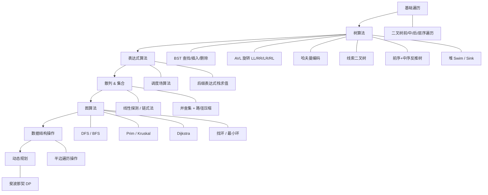

# 算法索引

已学过的所有算法，按主题分类。

---

## 一、搜索算法

| 算法 | 核心思想 | 笔记位置 |
|------|---------|---------|
| **深度优先搜索 DFS** | 沿一条路径尽可能深入，回溯后换路 | [[../数据结构/draft/图-draft#深度优先搜索\|图 → DFS]] |
| **广度优先搜索 BFS** | 按层级层层扩散，近的先访问 | [[../数据结构/draft/图-draft#广度优先搜索\|图 → BFS]] |

---

## 二、图算法

| 算法 | 核心思想 | 笔记位置 |
|------|---------|---------|
| **Prim 算法** | 以点为核心，每次找离当前集合最近的顶点加入（稠密图友好） | [[../数据结构/draft/图-draft#最小生成树\|图 → 最小生成树]] |
| **Kruskal 算法** | 以边为核心，每次取最小权边，不连通才加入 | [[../数据结构/draft/图-draft#最小生成树\|图 → 最小生成树]] |
| **Dijkstra 算法** | 贪心：每次选距离最短的未确定结点，用它去松弛其他结点 | [[../数据结构/draft/图-draft#单源最短路径\|图 → 单源最短路径]] |
| **找环（无向图）** | DFS + parent 标记 / 并查集判连通 | [[../数据结构/draft/图-draft#找环 Cycle Detection\|图 → 找环]] |
| **寻找最小环** | 平面图：每次走最左的边 / 分治递归 | [[../数据结构/draft/图-draft#寻找最小环\|图 → 寻找最小环]] |

---

## 三、树算法

| 算法 | 核心思想 | 笔记位置 |
|------|---------|---------|
| **二叉树遍历**（前/中/后/层序） | 递归骨架，visit 位置决定顺序 | [[../数据结构/树#三种遍历顺序\|树 → 遍历]] |
| **前序+中序构造二叉树** | 前序定根，中序分左右，递归 | [[../数据结构/树#根据遍历结果反推树结构\|树 → 反推树结构]] |
| **BST 查找** | 比根小走左，比根大走右 | [[../数据结构/树#查找\|树 → BST 查找]] |
| **BST 插入** | 同查找，空位即插入点 | [[../数据结构/树#插入\|树 → BST 插入]] |
| **BST 删除** | 叶子直接删 / 单孩子替上来 / 双孩子找后继替 | [[../数据结构/树#删除（三种情况）\|树 → BST 删除]] |
| **AVL 旋转**（LL/RR/LR/RL） | 平衡因子超 ±1 时旋转恢复 | [[../数据结构/树#AVL 树\|树 → AVL]] |
| **哈夫曼编码** | 频率低的字符路径长，频率高的路径短，WPL 最小 | [[../数据结构/树#哈夫曼树和哈夫曼编码\|树 → 哈夫曼]] |
| **线索二叉树** | 把 n+1 个空指针利用起来指向前驱/后继 | [[../数据结构/树#线索二叉树\|树 → 线索二叉树]] |
| **堆操作 — Swim 上浮** | Insert 后新元素与父节点比较，必要时交换，逐层上浮 | [[../数据结构/draft/数据结构和抽象数据类型-draft#案例 1：二叉堆——逻辑是树，物理是数组，但叫"堆"\|ADT → 堆]] |
| **堆操作 — Sink 下沉** | ExtractMax 后末尾元素与子节点比较，必要时交换，逐层下沉 | [[../数据结构/draft/数据结构和抽象数据类型-draft#案例 1：二叉堆——逻辑是树，物理是数组，但叫"堆"\|ADT → 堆]] |

---

## 四、表达式算法

| 算法 | 核心思想 | 笔记位置 |
|------|---------|---------|
| **调度场算法（Shunting-Yard）** | 中缀转后缀：操作数直接输出，运算符压栈前把 ≥ 优先级的先弹出 | [[../数据结构/树#C 实现：中缀 → 后缀\|树 → 调度场]] |
| **后缀表达式求值** | 栈：遇操作数 Push，遇运算符 Pop 两个 → 算完 Push 回去 | [[../数据结构/树#用栈求后缀表达式的值\|树 → 后缀求值]] |

---

## 五、集合与散列算法

| 算法 | 核心思想 | 笔记位置 |
|------|---------|---------|
| **散列函数设计**（除留余数法等） | 把 key 映射到数组下标，均匀分布 | [[../数据结构/散列表#常见的散列函数\|散列表 → 散列函数]] |
| **线性探测（开放寻址）** | 冲突后往后找空位，环状探测 | [[../数据结构/散列表#1. 线性探测（开放寻址法）\|散列表 → 线性探测]] |
| **链式法（拉链法）** | 每个槽位挂链表/红黑树，冲突元素串在同一链上 | [[../数据结构/散列表#2. 链式法（拉链法）\|散列表 → 链式法]] |
| **并查集 — 快速查询** | 数组存集合编号，合并需遍历全数组 | [[../数据结构/树#快速查询\|树 → 并查集]] |
| **并查集 — 快速合并** | 森林结构，数组存父节点；合并 O(1)，查询需向上找根 | [[../数据结构/树#快速合并\|树 → 并查集]] |
| **路径压缩**（隔代 / 完全压缩） | Find 时把路径上结点直接挂到根，平摊 O(α(n)) | [[../数据结构/树#路径压缩\|树 → 路径压缩]] |

---

## 六、动态规划（刚开始）

| 算法 | 核心思想 | 笔记位置 |
|------|---------|---------|
| **斐波那契（DP 入门）** | 递归式 + 子问题重叠 → 记忆化或递推 | [[../数据结构/dot/动态规划-draft\|动态规划 draft]] |

---

## 七、数据结构操作

> 这些不是独立的"算法"，而是某种数据结构自带的遍历 / 构建模式。靠指针关系实现 O(1) 跳转，是所有网格编辑操作（增删顶点、翻转边、拉伸面）的积木。

| 操作 | 核心模式 | 笔记位置 |
|------|---------|---------|
| **绕面走一圈**（Face → 全部顶点） | `current = current.Next`，`do-while` 回到起点 | [[../数据结构/半边数据结构#遍历 1：绕面走一圈（Face → 全部顶点）\|半边 → 遍历1]] |
| **绕顶点走一圈**（Vertex → 全部相邻面） | `current = current.Prev.Pair`，跳到对侧面对应半边 | [[../数据结构/半边数据结构#遍历 2：绕顶点走一圈（Vertex → 全部相邻面）\|半边 → 遍历2]] |
| **找共用边的两个面** | `edge.Face` + `edge.Pair?.Face`，单步 O(1) | [[../数据结构/半边数据结构#遍历 3：找出共用一条边的两个面\|半边 → 遍历3]] |
| **面的所有相邻面** | 绕面走一圈，每步 `current.Pair?.Face` | [[../数据结构/半边数据结构#遍历 4：面的所有相邻面\|半边 → 遍历4]] |
| **构建 Pair 关系** | `Dictionary<(from,to), HalfEdge>` 查反向键，O(n) 一次遍历配对 | [[../数据结构/半边数据结构#完整的 Mesh 构建器\|半边 → 构建器]] |
| **判断环的方向**（逆时针/顺时针） | 沿行走方向左侧偏移出 testP，射线法数交点，奇偶判定 | [[../数据结构/判断环的方向（逆时针与顺时针）\|环 → 方向判定]] |

---

## 八、散列表的工程实践（C#）

| 主题 | 要点 | 笔记位置 |
|------|------|---------|
| GetHashCode / Equals 一致性 | a == b ⇒ 哈希码必相同 | [[../数据结构/散列表#散列函数在C 的设计\|散列表 → C# 设计]] |
| 三层控制：默认 → override → IEqualityComparer\<T\> | 逐层递进的自定义能力 | [[../数据结构/散列表#工程的三层控制\|散列表 → 三层控制]] |
| 装填因子 & 扩容 | 0.7 理想值，扩容须重新计算所有 hash | [[../数据结构/散列表#找到平衡\|散列表 → 平衡]] |
| 槽位状态机（Empty / Occupied / Deleted） | 墓碑不能标 Empty —— 探测链会断 | [[../数据结构/散列表#槽位状态机 —— 每个格子的三种身份\|散列表 → 状态机]] |

---

## 算法清单（按学习顺序）

---

> [!NOTE] 当前进度
> 数据结构部分（表/栈/队列/散列表/二叉树/BST/AVL/哈夫曼/并查集/堆）已基本学完，表达式算法（调度场）也学完了。图刚开始——定义 + 存储结构 + DFS/BFS + 最小生成树 + Dijkstra + 找环已涉及，半边数据结构及其遍历操作也已学完，动态规划刚开了个头（斐波那契）。
